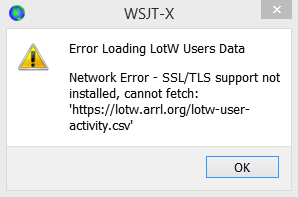

# WSJT-X 2.0 User Guide
Joseph H Taylor, Jr, K1JT version 2.0.1 

## 1. Introduction

WSJT-X is a computer program designed to facilitate basic amateur radio communication using very weak signals. The first four letters in the program name stand for “**W**eak **S**ignal communication by K1**JT**,” while the suffix “-X” indicates that WSJT-X started as an extended and experimental branch of the program *WSJT*.

WSJT-X Version 2.0 offers nine different protocols or modes: **FT8**, **JT4**, **JT9**, **JT65**, **QRA64**, **ISCAT**, **MSK144**, **WSPR**, and **Echo**. The first five are designed for making reliable QSOs under extreme weak-signal conditions. They use nearly identical message structure and source encoding. JT65 and QRA64 were designed for EME (“moonbounce”) on the VHF/UHF bands and have also proven very effective for worldwide QRP communication on the HF bands. QRA64 has a number of advantages over JT65, including better performance on the very weakest signals. We imagine that over time it may replace JT65 for EME use. JT9 was originally designed for the LF, MF, and lower HF bands. Its submode JT9A is 2 dB more sensitive than JT65 while using less than 10% of the bandwidth. JT4 offers a wide variety of tone spacings and has proven highly effective for EME on microwave bands up to 24 GHz. These four “slow” modes use one-minute timed sequences of alternating transmission and reception, so a minimal QSO takes four to six minutes — two or three transmissions by each station, one sending in odd UTC minutes and the other even. FT8 is operationally similar but four times faster (15-second T/R sequences) and less sensitive by a few dB. On the HF bands, world-wide QSOs are possible with any of these modes using power levels of a few watts (or even milliwatts) and compromise antennas. On VHF bands and higher, QSOs are possible (by EME and other propagation types) at signal levels 10 to 15 dB below those required for CW.

**ISCAT**, **MSK144**, and optionally submodes **JT9E-H** are “fast” protocols designed to take advantage of brief signal enhancements from ionized meteor trails, aircraft scatter, and other types of scatter propagation. These modes use timed sequences of 5, 10, 15, or 30 s duration. User messages are transmitted repeatedly at high rate (up to 250 characters per second, for MSK144) to make good use of the shortest meteor-trail reflections or “pings”. ISCAT uses free-form messages up to 28 characters long, while MSK144 uses the same structured messages as the slow modes and optionally an abbreviated format with hashed callsigns.

**WSPR** (pronounced “whisper”) stands for **W**eak **S**ignal **P**ropagation **R**eporter. The WSPR protocol was designed for probing potential propagation paths using low-power transmissions. WSPR messages normally carry the transmitting station’s callsign, grid locator, and transmitter power in dBm, and they can be decoded at signal-to-noise ratios as low as -31 dB in a 2500 Hz bandwidth. WSPR users with internet access can automatically upload reception reports to a central database called [WSPRnet](http://wsprnet.org/drupal/) that provides a mapping facility, archival storage, and many other features.

**Echo** mode allows you to detect and measure your own station’s echoes from the moon, even if they are far below the audible threshold.

*WSJT-X* provides spectral displays for receiver passbands as wide as 5 kHz, flexible rig control for nearly all modern radios used by amateurs, and a wide variety of special aids such as automatic Doppler tracking for EME QSOs and Echo testing. The program runs equally well on Windows, Macintosh, and Linux systems, and installation packages are available for all three platforms.

**Version Numbers**: WSJT-X release numbers have major, minor, and patch numbers separated by periods: for example, WSJT-X Version 1.9.0. Temporary “beta” release candidates are sometimes made in advance of a new general-availability release, in order to obtain user feedback. For example, version 1.9.0-rc1, 1.9.0-rc2, etc., would be beta releases leading up to the final release of v1.9.0. Release candidates should be used only during a short testing period. They carry an implied obligation to provide feedback to the program development group. Candidate releases should not be used on the air after a full release with the same number has been made.

### 1.1. New in Version 2.0.1

For quick reference, here’s a short list of features and capabilities added to WSJT-X since Version 1.9.1:

* New FT8 and MSK144 protocols with 77-bit payloads permit these enhancements:
    * Optimized contest messages for NA VHF, EU VHF, Field Day, RTTY Roundup
    * Full support for "/R" and "/P" calls in relevant contests
    * New logging features for contesting
    * Integration with [N1MM Logger+](https://n1mm.hamdocs.com/tiki-index.php) and [Writelog](https://writelog.com/) for contesting
    * Improved support for compound and nonstandard callsigns
    * Nearly equal (or better) sensitivity compared to old protocols
    * Lower false decode rates
* Improved color highlighting of received messages
* Improved WSPR sensitivity
* Expanded and improved UDP messages sent to companion programs
* Bug fixes and other minor tweaks to user interface

> :warning:
> Note that for FT8 and MSK144 there is no backward compatibility with WSJT-X 1.9.1 and earlier. Everyone using these modes should upgrade to WSJT-X 2.0 by January 1, 2019.

> :warning:
> WSJT-X Version 2.0 drops support for Apple Mac OS X 10.9 (Mavericks). It is possible to build from source for this operating system version but the DMG installer package requires 10.10 or later.

### 1.2. Documentation Conventions

In this manual the following icons call attention to particular types of information:

> :loudspeaker: 
> Notes containing information that may be of interest to particuar classes of users.

> :bell:
> Tips on program features or capabilities that might otherwise be overlooked.

> :warning:
> Warnings about usage that could lead to undesired consequences.

### 1.3. How You Can Contribute

WSJT-X is part of an open-source project released under the [GNU General Public License](http://www.gnu.org/licenses/gpl-3.0.txt) (GPLv3). If you have programming or documentation skills or would like to contribute to the project in other ways, please make your interests known to the development team. The project’s source-code repository can be found at [SourceForge](https://sourceforge.net/p/wsjt/wsjtx/ci/master/tree/), and communication among the developers takes place on the email reflector [wsjt-devel@lists.sourceforge.net](mailto:wsjt-devel@lists.sourceforge.net). Bug reports and suggestions for new features, improvements to the WSJT-X User Guide, etc., may also be sent to the [WSJT Group](https://groups.yahoo.com/neo/groups/wsjtgroup/info) email reflector. You must join the relevant group before posting to either email list.

## 2. System Requirements

* SSB transceiver and antenna
* Computer running Windows (XP or later), Linux, or OS X
* 1.5 GHz or faster CPU and 200 MB of available memory; faster machines are better
* Monitor with at least 1024 x 780 resolution
* Computer-to-radio interface using a serial port or equivalent USB device for T/R switching, or CAT control, or VOX, as required for your radio-to-computer connections
* Audio input and output devices supported by the operating system and configured for sample rate 48000 Hz, 16 bits
* Audio or equivalent USB connections between transceiver and computer
* A means for synchronizing the computer clock to UTC within ±1 second

## 3. Installation

Installation packages for released versions on Windows, Linux, and OS X are found on the WSJT Home Page. Click on the WSJT-X link at the left margin and select the appropriate package for your operating system.

### 3.1. Windows

Download and execute the package file wsjtx-2.0.1-win32.exe, following these instructions:

* Install *WSJT-X* into its own directory, for example C:\WSJTX or \` C:\WSJT\WSJTX\`, rather than the conventional location C:\Program Files (x86)\WSJTX.
* All program files relating to *WSJT-X* will be stored in the chosen installation directory and its subdirectories.
* Logs and other writeable files will normally be found in the directory C:\Users\<username>\AppData\Local\WSJT-X.

> :bell:	
> Your computer may be configured so that this directory is "invisible". It’s there, however, and accessible. An alternative (shortcut) directory name is "%LocalAppData%\WSJT-X\".

* The built-in Windows facility for time synchronization is usually not adequate. We recommend the program *Meinberg NTP* (see [Network Time Protocol Setup](http://www.satsignal.eu/ntp/setup.html) for downloading and installation instructions) or *Dimension 4* from [Thinking Man Software](http://www.thinkman.com/dimension4/). Recent versions of Windows 10 are now shipped with a more capable Internet time synchronization service that is suitable if configured appropriately.

    

* From this version onward *WSJT-X* requires the *OpenSSL* libraries to be installed. Suitable libraries may already be installed on your system, if they are not you will see this error shortly after startup. To fix this you need to install the *OpenSSL* libraries.
    * You can download a suitable *OpenSSL* package for from [Windows OpenSSL Packages](https://slproweb.com/products/Win32OpenSSL.html), you need the latest **Win32 v1.0.2 Lite** version (Note it is the Win32 package even if you are using a 64-bit Windows operating system) which at the time of writing was [Win32 OpenSSL Lite Package](https://slproweb.com/download/Win32OpenSSL_Light-1_0_2q.exe).
    * Install the package and accept the default options, including the option to copy the *OpenSSL* DLLs to the Windows system directory (this is important).

> :loudspeaker:
> If you still get the same network error after installing the *OpenSSL* libraries then you also need to install the [Microsoft VC++ 2013 Redistributable](https://www.microsoft.com/en-ph/download/details.aspx?id=40784) component. From the download page select ` vcredist_x86.exe ` and run it to install.

> :loudspeaker:
> If you cannot install the *OpenSSL* libraries or do not have an Internet connection on the computer used to run *WSJT-X* 2.0, you can download the *LoTW* file manually. Go to https://lotw.arrl.org/lotw-user-activity.csv in a web browser, download the file, then move it to the *WSJT-X* log files directory. This directory can be opened by selecting **File | Open log directory**.

* *WSJT-X* expects your sound card to do its raw sampling at 48000 Hz. To ensure that this will be so when running under recent versions of Windows, open the system’s **Sound** control panel and select in turn the **Recording** and **Playback** tabs. Click on **Properties**, then **Advanced**, and select **16 bit, 48000 Hz (DVD Quality)**. Switch of all audio enhancement features for these devices.

* You can uninstall *WSJT-X* by clicking its **Uninstall** link in the Windows **Start** menu, or by using **Uninstall a Program** on the Windows Control Panel Programs and Features option or in Settings Apps on Windows 10.

### 3.2. Linux

Debian, Ubuntu, and other Debian-based systems including Raspbian:

> :loudspeaker:
> The project team release binary installer packages for Linux when a new WSJT-X release is announced, note that these are built to target one contemporary version of a Linux distribution. Although these may work on newer Linux versions or even different distributions, it is unlikely that they will work on older versions. Check the notes provided with the release for details of the targeted Linux distributions and versions. If the binary package is not compatible with your Linux distribution or version you must build the application from sources.

* 32-bit: wsjtx_2.0.1_i386.deb
    * To install:
        ```
        sudo dpkg -i wsjtx_2.0.1_i386.deb 
        ```
    * Uninstall:
        ```
        sudo dpkg -P wsjtx
        ```
* 64-bit: wsjtx_2.0.1_amd64.deb
    * To install:
        ```
        sudo dpkg -i wsjtx_2.0.1_amd64.deb
        ```
* 64-bit: wsjtx_2.0.1_armhf.deb
    * To install:
        ```
        sudo dpkg -i wsjtx_2.0.1_armhf.deb
        ```
    * Uninstall:
        ```
        sudo dpkg -P wsjtx
        ```

You may also need to execute the following command in a terminal:
```
sudo apt install libqt5multimedia5-plugins libqt5serialport5 libqt5sql5-sqlite libfftw3-single3
```

Fedora, CentOS, Red Hat, and other rpm-based systems:
* 32-bit: wsjtx-2.0.1-i686.rpm
    * To install:
        ```
        sudo rpm -i wsjtx-2.0.1-i686.rpm
        ```
    * Uninstall:
        ```
        sudo rpm -e wsjtx
        ```
* 64-bit: wsjtx-2.0.1-x86_64.rpm
    * To install:
        ```
        sudo rpm -i wsjtx-2.0.1-x86_64.rpm
        ```
    * Uninstall:
        ```
        sudo rpm -e wsjtx
        ```

You may also need to execute the following command in a terminal:
```
sudo dnf install fftw-libs-single qt5-qtmultimedia qt5-qtserialport
```

### 3.3. OS X and macOS

**OS X 10.10** and later: Download the file [wsjtx-2.0.1-Darwin.dmg](http://physics.princeton.edu/pulsar/K1JT/wsjtx-2.0.1-Darwin.dmg) to your desktop, double-click on it and consult its ReadMe file for important installation notes.

If you have already installed a previous version, you can retain it by changing its name in the **Applications** folder (say, from *WSJT-X* to *WSJT-X_1.9*). You can then proceed to the installation phase.

Take note also of the following:
* Use the Mac’s **Audio MIDI Setup** utility to configure your sound card for 48000 Hz, two-channel, 16-bit format.

> :loudspeaker:
> If you are using macOS with an external audio device and find that Tx audio spontaneously switches to the motherboard sound device after a few transmissions, try setting the sample rate to 44100 Hz rather than the otherwise recommended 48000 Hz.

* Use **System Preferences** to select an external time source to keep your system clock synchronized to UTC.
* To uninstall simply drag the *WSJT-X* application from **Applications** to the **Trash Can**.

4. Settings

Select Settings from the File menu or by typing F2. (On Macintosh select Preferences from the WSJT-X menu, or use the keyboard shortcut Cmd+,). The following sections describe setup options available on each of eight tabs selectable near the top of the window.
4.1. General
Settings Window

Select the General tab on the Settings window. Under Station Details enter your callsign, grid locator (preferably the 6-character locator) and IARU Region number. Region 1 is Europe, Africa, the Middle East, and Northern Asia; Region 2 the Americas; and Region 3 Southern Asia and the Pacific. This information will be sufficient for initial tests.

Meanings of remaining options on the General tab should be self-explanatory after you have made some QSOs using WSJT-X. You may return to set these options to your preferences later.
	If you are using a callsign with an add-on prefix or suffix, or wish to work a station using such a call, be sure to read the section Compound Callsigns.
	Checking Enable VHF/UHF/Microwave features necessarily disables the wideband multi-decode capability of JT65. In most circumstances you should turn this feature off when operating at HF.
4.2. Radio
Radio Tab

WSJT-X offers CAT (Computer Aided Transceiver) control of relevant features of most modern transceivers. To configure the program for your radio, select the Radio tab.

    Select your radio type from the drop-down list labeled Rig, or None if you do not wish to use CAT control.

        Alternatively, if you have configured your station for control by DX Lab Suite Commander, Flrig, Ham Radio Deluxe, Hamlib NET rigctl, or Omni-Rig, you may select one of those program names from the Rig list. In these cases the entry field immediately under CAT Control will be relabeled as Network Server. Leave this field blank to access the default instance of your control program, running on the same computer. If the control program runs on a different computer and/or port, specify it here. Hover the mouse pointer over the entry field to see the required formatting details.

        Select Omni-Rig Rig 1 or Omni-Rig Rig 2 to connect to an Omni-Rig server installed on the same computer. Omni-Rig will be started automatically by WSJT-X.
    	Omni-Rig is available only under Windows.

    Set Poll Interval to the desired interval for WSJT-X to query your radio. For most radios a small number (say, 1 – 3 s) is suitable.

    CAT Control: To have WSJT-X control the radio directly rather than though another program, make the following settings:

        Select the Serial Port or Network Server including the service port number used to communicate with your radio.
        	A special value of USB is available for custom USB devices like those used by some SDR kits. This is not the same a virtual serial port provided by USB connected transcivers and CAT interfaces, for those use the COM or serial port name that refers to them.

        Serial Port Parameters: Set values for Baud Rate, Data Bits, Stop Bits, and Handshake method. Consult your radio’s user *guide for the proper parameter values.
    	CAT interfaces that require handshaking will be non-responsive until the correct Handshake setting is applied.

        Force Control Lines: A few station setups require the CAT serial port’s RTS and/or DTR control lines to be forced high or low. Check these boxes only if you are sure they are needed (for example, to power the radio serial interface).

    PTT Method: select VOX, CAT, DTR, or RTS as the desired method for T/R switching. If your choice is DTR or RTS, select the desired serial port (which may be the same one as used for CAT control).
    	When using a proxy application for rig control, CAT is usually the correct option for PTT Method assuming the proxy application is capable of keying your transceiver idependently.

    Transmit Audio Source: some radios permit you to choose the connector that will accept Tx audio. If this choice is enabled, select Rear/Data or Front/Mic.

    Mode: WSJT-X uses upper sideband mode for both transmitting and receiving. Select USB, or choose Data/Pkt if your radio offers such an option and uses it to enable the rear-panel audio line input. Some radios also offer wider and/or flatter passbands when set to Data/Pkt mode. Select None if you do not want WSJT-X to change the radio’s Mode setting.

    Split Operation: Significant advantages result from using Split mode (separate VFOs for Rx and Tx) if your radio supports it. If it does not, WSJT-X can emulate such behavior. Either method will result in a cleaner transmitted signal, by keeping the Tx audio always in the range 1500 to 2000 Hz so that audio harmonics cannot pass through the Tx sideband filter. Select Rig to use the radio’s Split mode, or Fake It to have WSJT-X adjust the VFO frequency as needed, when T/R switching occurs. Choose None if you do not wish to use split operation.

When all required settings have been made, click Test CAT to test communication between WSJT-X and your radio. The button should turn green to indicate that proper communication has been established. Failure of the CAT-control test turns the button red and displays an error message. After a successful CAT test, toggle the Test PTT button to confirm that your selected method of T/R control is working properly. (If you selected VOX for PTT Method, you can test T/R switching later by using the Tune button on the main window.)
4.3. Audio
_WSJT-X_ Audio Configuration Screen

Select the Audio tab to configure your sound system.

    Soundcard: Select the audio devices to be used for Input and Output. Usually the Mono settings will suffice, but in special cases you can choose Left, Right, or Both stereo channels.

        Be sure that your audio device is configured to sample at 48000 Hz, 16 bits.
        	If you select the audio output device that is also your computer’s default audio device, be sure to turn off all system sounds to prevent inadvertently transmitting them over the air.
        	Windows Vista and later may configure audio devices using the Texas Instruments PCM2900 series CODEC for microphone input rather line input. (This chip is used in many radios with built-in USB CODECs, as well as various other audio interfaces.) If you are using such a device, be sure to set the mic level in the Recording Device Properties to 0 dB.

    Save Directory: WSJT-X can save its received audio sequences as .wav files. A default directory for these files is provided; you can select another location if desired.

    AzEl Directory: A file named azel.dat will appear in the specified directory. The file contains information usable by another program for automatic tracking of the Sun or Moon, as well as calculated Doppler shift for the specified EME path. The file is updated once per second whenever the Astronomical Data window is displayed.

    Remember power settings by band: Checking either of these will cause WSJT-X to remember the Pwr slider setting for that operation on a band-by-band basis. For example, when Tune is checked here and you click the Tune button on the main window, the power slider will change to the most recent setting used for Tune on the band in use.

4.4. Tx Macros
Tx Macros Screen

Tx Macros are an aid for sending brief, frequently used free-text messages such as the examples shown above.

    To add a new message to the list, enter the desired text (up to 13 characters) in the entry field at top, then click Add.

    To remove an unwanted message, click on the message and then on Delete.

    You can reorder your macro messages by using drag-and-drop. The new order will be preserved when WSJT-X is restarted.

    Messages can also be added from the main window’s Tx5 field on Tab 1 or the Free msg field on Tab 2. Simply hit [Enter] after the message has been entered.

4.5. Reporting
Reporting Screen

    Logging: Choose any desired options from this group. Operators in a multi-operator station may wish to enter their home callsign as Op Call.

    Network Services: Check Enable PSK Reporter Spotting to send reception reports to the PSK Reporter mapping facility.

    UDP Server: This group of options controls the network name or address and port number used by a program that will receive status updates from WSJT-X. Cooperating applications like JTAlert use this feature to obtain information about a running WSJT-X instance. If you are using JTAlert, be sure to check the three boxes at lower right.

    N1MM Logger+ Broadcasts: To send information on logged QSOs directly to N1MM Logger+, check the box and enter the IP address and port number for N1MM.

4.6. Frequencies
Frequency Screen

Working Frequencies: By default the Working Frequencies table contains a list of frequencies conventionally used for modes FT8, JT4, JT9, JT65, MSK144, WSPR, and Echo. Conventions may change with time or by user preference; you can modify the frequency table as desired.

    To change an existing entry, double-click to edit it, type a desired frequency in MHz or select from the drop down list of options, then hit Enter on the keyboard. The program will format your changed entry appropriately.

    To add a new entry, right-click anywhere on the frequency table and select Insert. Enter a frequency in MHz in the pop-up box and select the desired mode (or leave the Mode selection as All). Then click OK. The table may include more than one frequency for a given band.

    To delete an entry, right-click it and select Delete, multiple entries can be deleted in a single operation by selecting them before right-clicking.

    Right-click any entry and click Reset button to return the table to its default configuration.

Other more advanced maintenance operations are available on the right-click context menu that should be self-explanatory.

Frequency Calibration: If you have calibrated your radio using WWV or other reliable frequency references, or perhaps with the technique described in Accurate Frequency Measurements with your WSPR Setup, enter the measured values for Intercept A and Slope B in the equation

Dial error = A + B*f

where “Dial error” and A are in Hz, f is frequency in MHz, and B is in parts per million (ppm). Frequency values sent to the radio and received from it will then be adjusted so that frequencies displayed by WSJT-X are accurate.

Station Information: You can save Band, Offset and Antenna Description information for your station. The antenna information will be included in reception reports sent to PSK Reporter. By default the frequency offset for each band is zero. Nonzero offsets may be added if (for example) a transverter is in use.

    To simplify things you might want to delete any unwanted bands — for example, bands where you have no equipment. Then click on a Frequency entry and type Ctrl+A to “select all,” and drag-and-drop the entries onto the Station Information table. You can then add any transverter offsets and antenna details.

    To avoid typing the same information many times, you can drag-and-drop entries between the lines of the Station Information table.

    When all settings have been configured to your liking, click OK to dismiss the Settings window.

4.7. Colors
Colors Screen
Decode Highlighting

    WSJT-X uses colors to highlight decoded CQ messages of particular interest. Check the box Show DXCC, grid, and worked-before status on the Settings | General tab, and any boxes of interest to you on the Colors tab. You can drag any line up or down to raise or lower its logical priority. Right-click any line to set a new foreground or background color. Foreground and background colors are applied separately, and careful choices of foreground, background, and priority can provide two indications of worked-before status.

    Press the Reset Highlighting button to reset all of the color settings to default values.

    Check Highlight by Mode if you wish worked before status to be per mode.

    Worked before status is calculated from your WSJT-X ADIF Logging file, you may replace ADIF log file with one exported from your station logging application, Rescan ADIF Log rebuilds the WSJT-X worked before indexes using the current ADIF log file.
    	The WSJT-X ADIF file records must contain the "CALL" field. The "BAND", and "MODE", and "GRIDSQUARE" fields are optional depending on your DXing objectives. DXCC entity, continent, CQ, and ITU Zone data for call prefixes and certain well known overrides are derived from the cty.dat database which is bundled with WSJT-X (See Logging for details).

Logbook of The World User Validation

Stations who are known to have uploaded their logs to the ARRL LoTW QSL matching service can be highlighted. The data used to determine this is available on line.

    Fetch Now will download a fresh dataset from the Users CSV file URL. The LoTW team normally update this data weekly.

    Adjust Age of of last upload less than to set the period within which a station must have uploaded their log to LoTW to trigger highlighting.

4.8. Advanced
Settings Advanced

JT65 decoding parameters

    Random erasure patterns logarithmically scales the number of pseudo-random trials used by the Franke-Taylor JT65 decoder. Larger numbers give slightly better sensitivity but take longer. For most purposes a good setting is 6 or 7.

    Aggressive decoding level sets the threshold for acceptable decodes using Deep Search. Higher numbers will display results with lower confidence levels.

    Check Two-pass decoding to enable a second decoding pass after signals producing first-pass decodes have been subtracted from the received data stream.

Miscellaneous

    Set a positive number in Degrade S/N of .wav file to add known amounts of pseudo-random noise to data read from a .wav file. To ensure that the resulting S/N degradation is close to the requested number of dB, set Receiver bandwidth to your best estimate of the receiver’s effective noise bandwidth.

    Set Tx delay to a number larger than the default 0.2 s to create a larger delay between execution of a command to enable PTT and onset of Tx audio.
    	For the health of your T/R relays and external preamplifier, we strongly recommend using a hardware sequencer and testing to make sure that sequencing is correct.

    Check x 2 Tone spacing or x 4 Tone spacing to generate Tx audio with twice or four times the normal tone spacing. This feature is intended for use with specialized LF/MF transmitters that divide generated frequencies by 2 or 4 as part of the transmission process.

Special Operating Activity: Generation of FT8 and MSk144 messages

    Check this box and select the type of activity to enable auto-generation of special message formats for contesting and DXpeditions. For ARRL Field Day, enter your operating Class and ARRL/RAC section; for ARRL RTTY Roundup, enter your state or province. Use “DX” for section or state if you are not in the US or Canada. In the RTTY Roundup, Stations in Alaska and Hawaii should enter “DX”.

    Check Fox if you are a DXpedition station operating in FT8 DXpedition Mode. Check Hound if you wish to make QSOs with such a Fox. Be sure to read the operating instructions for FT8 DXpedition Mode.

5. Transceiver Setup
Receiver Noise Level

    If it is not already highlighted in green, click the Monitor button to start normal receive operation.

    Be sure your transceiver is set to USB (or USB Data) mode.

    Use the receiver gain controls and/or the computer’s audio mixer controls to set the background noise level (scale at lower left of main window) to around 30 dB when no signals are present. It is usually best to turn AGC off or reduce the RF gain control to minimize AGC action.
    	The PC audio mixer normally has two sliders, one for each application attached which should be set to maximum (0dB FS) as it cannot help with distortion from overly high or low input levels from your receiver and another Master level which is analogue attenuator on the sound card before the Analogue to Digital Converter (ADC). The Master level can be used to adjust the signal level received by WSJT-X.

Bandwidth and Frequency Setting

    If your transceiver offers more than one bandwidth setting in USB mode, it may be advantageous to choose the widest one possible, up to about 5 kHz. This choice has the desirable effect of allowing the Wide Graph (waterfall and 2D spectrum) to display the conventional JT65 and JT9 sub-bands simultaneously on most HF bands. Further details are provided in the Basic Operating Tutorial. A wider displayed bandwidth may also be helpful at VHF and above, where FT8, JT4, JT65, and QRA64 signals may be found over much wider ranges of frequencies.

    If you have only a standard SSB filter you won’t be able to display more than about 2.7 kHz bandwidth. Depending on the exact dial frequency setting, on HF bands you can display the full sub-band generally used for one mode.

    Of course, you might prefer to concentrate on one mode at a time, setting your dial frequency to (say) 14.074 for FT8, 14.076 for JT65, or 14.078 for JT9. Present conventions have the nominal JT9 dial frequency 2 kHz higher than the JT65 dial frequency on most bands, and the FT8 frequency 2 kHz lower.

Transmitter Audio Level

    Click the Tune button on the main screen to switch the radio into transmit mode and generate a steady audio tone.

    Listen to the generated audio tone using your radio’s Monitor facility. The transmitted tone should be perfectly smooth, with no clicks or glitches. Make sure that this is true even when you simultaneously use the computer to do other tasks such as email, web browsing, etc..

    Adjust the Pwr slider (at right edge of main window) downward from its maximum until the RF output from your transmitter falls slightly. This is generally a good level for audio drive.

    Toggle the Tune button once more or click Halt Tx to stop your test transmission.

6. Basic Operating Tutorial

This section introduces the basic user controls and program behavior of WSJT-X, with particular emphasis on the JT9, JT65, and FT8 modes. We suggest that new users should go through the full HF-oriented tutorial, preferably while at your radio. Note that as of late 2018, digital usage on the HF bands has mostly moved from JT65 and JT9 to FT8. So you may wish to pay particular attention to FT8, in Section 6.6.

Subsequent sections cover additional details on Making QSOs, WSPR mode and VHF+ Features.
6.1. Main Window Settings

    Click the Stop button on the main window to halt any data acquisition.

    Select JT9 from the Mode menu and Deep from the Decode menu.

    Set the audio frequencies to Tx 1224 Hz and Rx 1224 Hz.
    	Sliders and spinner controls respond to Arrow key presses and Page Up/Down key presses, with the Page keys moving the controls in larger steps. You can also type numbers directly into the spinner controls or use the mouse wheel.

    Select Tab 2 (below the Decode button) to choose the alternative set of controls for generating and selecting Tx messages.

6.2. Download Samples

    Select Download samples…​ from the Help menu.

    Download some or all of the available sample files using checkboxes on the screen shown below. For this tutorial you will need at least the JT9 and JT9+JT65 files.

Downlod Samples
6.3. Wide Graph Settings

    Bins/Pixel = 4

    Start = 200 Hz

    N Avg = 5

    Palette = Digipan

    Flatten = checked

    Select Cumulative for data display

    Gain and Zero sliders for waterfall and spectrum set near midscale

    Spec = 25%

    Use the mouse to grab the left or right edge of the Wide Graph, and adjust its width so that the upper frequency limit is about 2400 Hz.

6.4. JT9

For this step and the next, you may want to pretend you are K1JT by entering that callsign temporarily as My Call on the Settings | General tab. Your results should then be identical to those shown in the screen shot below.
Open a Wave File:

    Select File | Open and select the file ...\save\samples\JT9\130418_1742.wav. When the file opens you should see something similar to the following screen shot:

Main UI and Wide Graph
Decoding Overview

Decoding takes place at the end of a receive sequence and proceeds in two steps. The first decode is done at the selected Rx frequency, indicated by the U-shaped green marker on the waterfall frequency scale. Results appear in both the left (Band Activity) and right (Rx Frequency) text windows on the main screen. The program then finds and decodes all signals in the selected mode over the displayed frequency range. The red marker on the waterfall scale indicates your Tx frequency.

Seven JT9 signals are present in the example file, all decodable. When this file was recorded KF4RWA was finishing a QSO with K1JT. Since the green marker was placed at his audio frequency, 1224 Hz, his message K1JT KF4RWA 73 is decoded first and appears in the Rx Frequency window. The Band Activity window shows this message plus all decodes at other frequencies. By default lines containing CQ are highlighted in green, and lines with My Call (in this case K1JT) in red.
Decoding Controls

To gain some feeling for controls frequently used when making QSOs, try clicking with the mouse on the decoded text lines and on the waterfall spectral display. You should be able to confirm the following behavior:

    Click or double-click on either of the decoded lines highlighted in green. These actions produce the following results:

        Callsign and locator of a station calling CQ are copied to the DX Call and DX Grid entry fields.

        Messages are generated for a standard minimal QSO.

        The Tx even box is checked or cleared appropriately, so that you will transmit in the proper (odd or even) minutes.

        The Rx frequency marker is moved to the frequency of the CQing station.

        The Gen Msg (“generated message”) radio button at bottom right of the main window is selected.

        Double-click does all of the above and also activates Enable Tx so that a transmission will start automatically at the proper time.

        You can modify the double-click behavior by holding down the Shift key to move only the Tx frequency or the Ctrl key to move both Rx and Tx frequencies.
    	You can prevent your Tx frequency from being changed by checking the box Hold Tx Freq.

    Double-click on the decoded message K1JT N5KDV EM41, highlighted in red. Results will be similar to those in the previous step. The Tx frequency (red marker) is not moved unless Shift or Ctrl is held down. Messages highlighted in red are usually in response to your own CQ or from a tail-ender, and you probably want your Tx frequency to stay where it was.

    Click somewhere on the waterfall to set Rx frequency (green marker on waterfall scale).

    Shift-click on the waterfall to set Tx frequency (red marker).

    Ctrl-click on the waterfall to set both Rx and Tx frequencies.

    Double-click on a signal in the waterfall to set Rx frequency and start a narrow-band decode there. Decoded text will appear in the right window only.

    Ctrl-double-click on a signal to set both Rx and Tx frequencies and decode at the new frequency.

    Click Erase to clear the right window.

    Double-click Erase to clear both text windows.

6.5. JT9+JT65
Main Window:

    Select JT9+JT65 on the Mode menu.

    Toggle the Tx mode button to read Tx JT65 #, and set the Tx and Rx frequencies to 1718 Hz.

    Double-click on Erase to clear both text windows.

Wide Graph Settings:

    Bins/Pixel = 7

    JT65 …​. JT9 = 2500

    Adjust the width of the Wide Graph window so that the upper frequency limit is approximately 4000 Hz.

Open a Wave File:

    Select File | Open and navigate to ...\save\samples\JT9+JT65\130610_2343.wav. The waterfall should look something like this:

Wide Graph Decode 130610_2343

The position of the blue marker on the waterfall scale is set by the spinner control JT65 nnnn JT9, where nnnn is an audio frequency in Hz. In JT9+JT65 mode the program will automatically decode JT9 signals only above this frequency. JT65 signals will be decoded over the full displayed frequency range.

JT9 signals appear in the Cumulative spectrum as nearly rectangular shapes about 16 Hz wide. They have no clearly visible sync tone like the one at the low-frequency edge of all JT65 signals. By convention the nominal frequency of both JT9 and JT65 signals is taken to be that of the lowest tone, at the left edge of its spectrum.

This sample file contains 17 decodable signals — nine in JT65 mode (flagged with the character # in the decoded text windows), and eight in JT9 mode (flagged with @). On multi-core computers the decoders for JT9 and JT65 modes run simultaneously, so their results will be interspersed. The Band Activity window contains all decodes (you might need to scroll back in the window to see some of them). A signal at the frequency specified by the green marker is given decoding priority, and its message is displayed also in the Rx Frequency window.
decodes

    Confirm that mouse-click behavior is similar to that described earlier, in Example 1. WSJT-X automatically determines the mode of each JT9 or JT65 message.
    	When you double-click on a signal in the waterfall it will be properly decoded even if on the “wrong” side of the JT65 nnnn JT9 marker. The Tx mode automatically switches to that of the decoded signal and the Rx and Tx frequency markers on the waterfall scale resize themselves accordingly. When selecting a JT65 signal, click on the sync tone at its left edge.

    Double-click on the waterfall near 815 Hz: a JT65 message originating from W7VP will be decoded and appear in the Rx Frequency window. Between the UTC and Freq columns on the decoded text line you will find dB, the measured signal-to-noise ratio, and DT, the signal’s time offset in seconds relative to your computer clock.

UTC 	dB 	DT 	Freq 	Mode 	Message

2343
	

-7
	

0.3
	

815
	

#
	

KK4DSD W7VP -16

    Double-click on the waterfall at 3196 Hz. The program will decode a JT9 message from IZ0MIT:

UTC 	dB 	DT 	Freq 	Mode 	Message

2343
	

-8
	

0.3
	

3196
	

@
	

WB8QPG IZ0MIT -11

    Scroll back in the Band Activity window and double-click on the message CQ DL7ACA JO40. The program will set Tx mode to JT65 and the Rx frequency to that of DL7ACA, 975 Hz. If you hold down the Ctrl key, both Rx and Tx frequencies will be moved. If you had checked Double-click on call sets Tx Enable on the Setup menu, the program would configure itself to begin a transmission and start a QSO with DL7ACA.

    Hold Ctrl down and double-click on the decoded JT65 message CQ TA4A KM37. The program will set Tx mode to JT9 and the Rx and Tx frequencies to 3567 Hz. The program is now configured properly for a JT9 QSO with TA4A.

Reopen the First Sample File:

    Select File | Open and navigate to …​\save\samples\130418_1742.wav.

Taking full advantage of the wide-band, dual-mode capability of WSJT-X requires a receiver bandwidth of at least 4 kHz. These data were recorded with a much narrower Rx bandwidth, roughly 200 to 2400 Hz. If you have no Rx filter wider than about 2.7 kHz, you will be using data like this. For best viewing, adjust Bins/Pixel and the width of the Wide Graph so that only the active part of the spectrum shows, say 200 to 2400 Hz. Re-open the example file after any change of Bins/Pixel or Wide Graph width, to refresh the waterfall.

The signals in this file are all JT9 signals. To decode them automatically in JT9+JT65 mode you’ll need to move the JT65 nnnn JT9 delimiter down to 1000 Hz or less.
Waterfall Controls

Now is a good time to experiment with the Start control and the sliders controlling gain and zero-point of the waterfall and spectrum plots. Start determines the frequency displayed at the left side of the waterfall scale. Sliders set the baseline level and gain for the waterfall and the several types of spectra. Good starting values should be close to mid-scale. You might want to uncheck Flatten when adjusting the sliders. Re-open the wave file after each change, to see the new results.
6.6. FT8
Main Window:

    Select FT8 on the Mode menu.

    Set Tx frequency to 1600 Hz, Rx to 1442 Hz.

    Double-click on Erase to clear both text windows.

Wide Graph Settings:

    Bins/Pixel = 4, Start = 200 Hz, N Avg = 2

    Adjust the width of the Wide Graph window so that the upper frequency limit is approximately 2600 Hz.

Open a Wave File:

    Select File | Open and navigate to ...\save\samples\FT8\181201_180245.wav. The waterfall and Band Activity window should look something like the following screen shots. (This recording was made during the "FT8 Roundup" contest, so most transmissions happen to be using RTTY Roundup message formats.)

Wide Graph Decode 170709_135615
ft8 decodes

    Click with the mouse anywhere on the waterfall display. The green Rx frequency marker will jump to your selected frequency, and the Rx frequency control on the main window will be updated accordingly.

    Do the same thing with the Shift key held down. Now the red Tx frequency marker and its associated control on the main window will follow your frequency selections.

    Do the same thing with the Ctrl key held down. Now the both colored markers and both spinner controls will follow your selections.

    Double-clicking at any frequency on the waterfall does all the things just described and also invokes the decoder in a small range around the Rx frequency. To decode a particular signal, double-click near the left edge of its waterfall trace.

    Now double-click on any of the the lines of decoded text in the Band Activity window. Any line will show the same behavior, setting Rx frequency to that of the selected message and leaving Tx frequency unchanged. To change both Rx and Tx frequencies, hold Ctrl down when double-clicking.

	To avoid QRM from competing callers, it is frequently desirable to answer a CQ on a different frequency from that of the CQing station. The same is true when you tail-end another QSO. Choose a Tx frequency that appears to be not in use. You might want to check the box Hold Tx Freq.
	Keyboard shortcuts Shift+F11 and Shift+F12 provide an easy way to move your Tx frequency down or up in 60 Hz steps.
	An online FT8 Operating Guide by ZL2IFB offers many helpful tips on operating procedures.
FT8 DXpedition Mode:

This special operating mode enables DXpeditions to make FT8 QSOs at very high rates. Both stations must use WSJT-X Version 1.9 or later. Detailed operating instructions for FT8 DXpedition Mode are available online. Do not try to use DXpedition mode without reading these instructions carefully!
	FT8 DXpedition mode is intended for use by rare-entity DXpeditions and other unusual circumstances in which sustained QSO rates well above 100/hour are expected. Do not use the multi-signal capability unless you satisfy this requirement, and do not use DXpedition Mode in the conventional FT8 sub-bands. If you are contemplating operation as Fox using DXpedition Mode, find a suitable dial frequency consistent with regional band plans and publicize it for the operators you hope to work. Remember that on-the-air signal frequencies will be higher than the dial frequency by up to 4 kHz.
	When finished with this Tutorial, don’t forget to re-enter your own callsign as My Call on the Settings | General tab.
7. Making QSOs
7.1. Standard Exchange

By longstanding tradition, a minimally valid QSO requires the exchange of callsigns, a signal report or some other information, and acknowledgments. WSJT-X is designed to facilitate making such minimal QSOs using short, structured messages. The process works best if you use these formats and follow standard operating practices. The recommended basic QSO goes something like this:

CQ K1ABC FN42                          #K1ABC calls CQ
                  K1ABC G0XYZ IO91     #G0XYZ answers
G0XYZ K1ABC –19                        #K1ABC sends report
                  K1ABC G0XYZ R-22     #G0XYZ sends R+report
G0XYZ K1ABC RRR                        #K1ABC sends RRR
                  K1ABC G0XYZ 73       #G0XYZ sends 73

Standard messages consist of two callsigns (or CQ, QRZ, or DE and one callsign) followed by the transmitting station’s grid locator, a signal report, R plus a signal report, or the final acknowledgements RRR or 73. These messages are compressed and encoded in a highly efficient and reliable way. In uncompressed form (as displayed on-screen) they may contain as many as 22 characters. Some operators prefer ro send RR73 rather than RRR. This is workable because RR73 is encoded as a valid grid locator, one unlikely ever to be occupied by an amateur station.

Signal reports are specified as signal-to-noise ratio (S/N) in dB, using a standard reference noise bandwidth of 2500 Hz. Thus, in the example message above, K1ABC is telling G0XYZ that his signal is 19 dB below the noise power in bandwidth 2500 Hz. In the message at 0004, G0XYZ acknowledges receipt of that report and responds with a –22 dB signal report. JT65 reports are constrained to lie in the range –30 to –1 dB, and values are significantly compressed above about -10 dB. JT9 supports the extended range –50 to +49 dB and assigns more reliable numbers to relatively strong signals.
	Signals become visible on the waterfall around S/N = –26 dB and audible (to someone with very good hearing) around –15 dB. Thresholds for decodability are around -20 dB for FT8, -23 dB for JT4, –25 dB for JT65, –27 dB for JT9.
	Several options are available for circumstances where fast QSOs are desirable. Double-click the Tx1 control under Now or Next to toggle use of the Tx2 message rather than Tx1 to start a QSO. Similarly, double-click the Tx4 control to toggle between sending RRR and RR73 in that message. The RR73 message should be used only if you are reasonably confident that no repetitions will be required.
7.2. Free-Text Messages

Users often add some friendly chit-chat at the end of a QSO. Free-format messages such as “TNX ROBERT 73” or “5W VERT 73 GL” are supported, up to a maximum of 13 characters, including spaces. In general you should avoid the character / in free-text messages, as the program may then try to interpret your construction as part of a compound callsign. It should be obvious that the JT4, JT9, and JT65 protocols are not designed or well suited for extensive conversations or rag-chewing.
7.3. Auto-Sequencing

The 15-second T/R cycles of FT8 allow only about two seconds to inspect decoded messages and decide how to reply, which is often not enough. The slow modes JT4, JT9, JT65, and QRA64 allow nearly 10 seconds for this task, but operators may find that this is still insufficient when workload is high, especially on EME. For these reasons a basic auto-sequencing feature is offered.

Check Auto Seq on the main window to enable this feature:
AutoSeq

When calling CQ you may also choose to check the box Call 1st. WSJT-X will then respond automatically to the first decoded responder to your CQ.
	When Auto-Seq is enabled the program de-activates Enable Tx at the end of each QSO. It is not intended that WSJT-X should make fully automated QSOs.
7.4. Contest Messages

The new FT8 and MSK144 protocols support special messages optimized for NA VHF and EU VHF contests. FT8 also supports messages for ARRL Field Day and the ARRL RTTY Roundup. The decoders recognize and decode these messages at any time. Configure the program to automatically generate the required message types by selecting a supported operating activity on the Settings | Advanced tab. Model QSOs then proceed as follows, for each event type:

NA VHF Contest

CQ K1ABC FN42
                      K1ABC W9XYZ EN37
W9XYZ K1ABC R FN42
                      K1ABC W9XYZ RRR
W9XYZ K1ABC 73

Either callsign (or both) may have /R appended. You can use RR73 in place of RRR, and the final 73 is optional.

EU VHF Contest

CQ TEST G4ABC IO91
                      G4ABC PA9XYZ JO22
PA9XYZ 570123 IO91NP
                      G4ABC R 580071 JO22DB
PA9XYZ G4ABC RR73

Either callsign (or both) may have /P appended.

ARRL Field Day

CQ FD K1ABC FN42
                      K1ABC W9XYZ 6A WI
W9XYZ K1ABC R 2B EMA
                      K1ABC W9XYZ RR73

ARRL RTTY Roundup

CQ RU K1ABC FN42
                      K1ABC W9XYZ 579 WI
W9XYZ K1ABC R 589 MA
                      K1ABC W9XYZ RR73

7.5. Nonstandard Callsigns

FT8 and MSK144

Compound callsigns like xx/K1ABC or K1ABC/x and special event callsigns like YW18FIFA are supported for normal QSOs but not for contest-style messages. Model QSOs look something like this:

CQ PJ4/K1ABC
                      <PJ4/K1ABC> W9XYZ
W9XYZ <PJ4/K1ABC> +03
                      <PJ4/K1ABC> W9XYZ R-08
<W9XYZ> PJ4/K1ABC RRR
                      PJ4/K1ABC <W9XYZ> 73

The compound or nonstandard callsigns are automatically recognized and handled using special message formats. One such callsign and one standard callsign may appear in most messages, provided that one of them is enclosed in < > angle brackets. If the message includes a grid locator or numerical signal report, the brackets must enclose the compound or nonstandard callsign; otherwise the brackets may be around either call.

Angle brackets imply that the enclosed callsign is not transmitted in full, but rather as a hash code using a smaller number of bits. Receiving stations will display the full nonstandard callsign if it has been received in full in the recent past. Otherwise it will be displayed as < . . . >. These restrictions are honored automatically by the algorithm that generates default messages for minimal QSOs. Except for the special cases involving /P or /R used in VHF contesting, WSJT-X 2.0 offers no support for two nonstandard callsigns to work each other.
	Using a nonstandard callsign has definite costs. It restricts the types of information that can be included in a message. It prevents including your locator in standard messages, which necessarily impairs the usefulness of tools like PSK Reporter.

JT4, JT9, JT65, and QRA64

In the 72-bit modes, compound callsigns are handled in one of two possible ways:
Type 1 compound callsigns

A list of about 350 of the most common prefixes and suffixes can be displayed from the Help menu. A single compound callsign involving one item from this list can be used in place of the standard third word of a message (normally a locator, signal report, RRR, or 73). The following examples are all acceptable messages containing Type 1 compound callsigns:

CQ ZA/K1ABC
CQ K1ABC/4
ZA/K1ABC G0XYZ
G0XYZ K1ABC/4

The following messages are not valid, because a third word is not permitted in any message containing a Type 1 compound callsign:

ZA/K1ABC G0XYZ -22        #These messages are invalid; each would
G0XYZ K1ABC/4 73          # be sent without its third "word"

A QSO between two stations using Type 1 compound-callsign messages might look like this:

CQ ZA/K1ABC
                    ZA/K1ABC G0XYZ
G0XYZ K1ABC –19
                    K1ABC G0XYZ R–22
G0XYZ K1ABC RRR
                    K1ABC G0XYZ 73

Notice that the full compound callsign is sent and received in the first two transmissions. After that, the operators omit the add-on prefix or suffix and use the standard structured messages.
Type 2 Compound callsigns

Prefixes and suffixes not found in the displayable short list are handled by using Type 2 compound callsigns. In this case the compound callsign must be the second word in a two- or three-word message, and the first word must be CQ, DE, or QRZ. Prefixes can be 1 to 4 characters, suffixes 1 to 3 characters. A third word conveying a locator, report, RRR, or 73 is permitted. The following are valid messages containing Type 2 compound callsigns:

CQ W4/G0XYZ FM07
QRZ K1ABC/VE6 DO33
DE W4/G0XYZ FM18
DE W4/G0XYZ -22
DE W4/G0XYZ R-22
DE W4/G0XYZ RRR
DE W4/G0XYZ 73

In each case, the compound callsign is treated as Type 2 because the add-on prefix or suffix is not one of those in the fixed list. Note that a second callsign is never permissible in these messages.
	During a transmission your outgoing message is displayed in the first label on the Status Bar and shown exactly as another station will receive it. You can check to see that you are actually transmitting the message you wish to send.

QSOs involving Type 2 compound callsigns might look like either of the following sequences:

CQ K1ABC/VE1 FN75
                    K1ABC G0XYZ IO91
G0XYZ K1ABC –19
                    K1ABC G0XYZ R–22
G0XYZ K1ABC RRR
                    K1ABC/VE1 73

CQ K1ABC FN42
                    DE G0XYZ/W4 FM18
G0XYZ K1ABC –19
                    K1ABC G0XYZ R–22
G0XYZ K1ABC RRR
                    DE G0XYZ/W4 73

Operators with a compound callsign use its full form when calling CQ and possibly also in a 73 transmission, as may be required by licensing authorities. Other transmissions during a QSO may use the standard structured messages without callsign prefix or suffix.
	If you are using a compound callsign, you may want to experiment with the option Message generation for type 2 compound callsign holders on the Settings | General tab, so that messages will be generated that best suit your needs.
7.6. Pre-QSO Checklist

Before attempting your first QSO with one of the WSJT modes, be sure to go through the Basic Operating Tutorial above as well as the following checklist:

    Your callsign and grid locator set to correct values

    PTT and CAT control (if used) properly configured and tested

    Computer clock properly synchronized to UTC within ±1 s

    Audio input and output devices configured for sample rate 48000 Hz, 16 bits

    Radio set to USB (upper sideband) mode

    Radio filters centered and set to widest available passband (up to 5 kHz).

	Remember that in many circumstances FT8, JT4, JT9, JT65, and WSPR do not require high power. Under most HF propagation conditions, QRP is the norm.
8. VHF+ Features

WSJT-X v2.0 suppports a number of features designed for use on the VHF and higher bands. These features include:

    FT8, a mode designed for making fast QSOs with weak, fading signals

    JT4, a mode particularly useful for EME on the microwave bands

    JT9 fast modes, useful for scatter propagation on VHF bands

    JT65, widely used for EME on VHF and higher bands

    QRA64, a mode for EME using a “Q-ary Repeat Accumulate” code, a low-density parity-check (LDPC) code using a 64-character symbol alphabet

    MSK144, a mode for meteor scatter using a binary LDPC code and Offset Quadrature Phase-Shift Keying (OQPSK). The resulting waveform is sometimes called Minimum Shift Keying (MSK).

    ISCAT, intended for aircraft scatter and other types of scatter propagation

    Echo mode, for detecting and measuring your own lunar echoes

    Doppler tracking, which becomes increasingly important for EME on bands above 1.2 GHz.

    Optional Auto-Sequencing in JT4, JT9, and JT65 as well as FT8 and QRA64.

8.1. VHF Setup

To activate the VHF-and-up features:

    On the Settings | General tab check Enable VHF/UHF/Microwave features and Single decode.

    For EME, check Decode after EME delay to allow for extra path delay on received signals.

    If you will use automatic Doppler tracking and your radio accepts frequency-setting commands while transmitting, check Allow Tx frequency changes while transmitting. Transceivers known to permit such changes include the IC-735, IC-756 Pro II, IC-910-H, FT-847, TS-590S, TS-590SG, TS-2000 (with Rev 9 or later firmware upgrade), Flex 1500 and 5000, HPSDR, Anan-10, Anan-100, and KX3. To gain full benefit of Doppler tracking your radio should allow frequency changes under CAT control in 1 Hz steps.

	If your radio does not accept commands to change frequency while transmitting, Doppler tracking will be approximated with a single Tx frequency adjustment before a transmission starts, using a value computed for the middle of the Tx period.

    On the Radio tab select Split Operation (use either Rig or Fake It; you may need to experiment with both options to find one that works best with your radio).

    On the right side of the main window select Tab 1 to present the traditional format for entering and choosing Tx messages.

The main window will reconfigure itself as necessary to display controls supporting the features of each mode.

    If you are using transverters, set appropriate frequency offsets on the Settings | Frequencies tab. Offset is defined as (transceiver dial reading) minus (on-the-air frequency). For example, when using a 144 MHz radio at 10368 MHz, Offset (MHz) = (144 - 10368) = -10224.000. If the band is already in the table, you can edit the offset by double clicking on the offset field itself. Otherwise a new band can be added by right clicking in the table and selecting Insert.

Station information

    On the View menu, select Astronomical data to display a window with important information for tracking the Moon and performing automatic Doppler control. The right-hand portion of the window becomes visible when you check Doppler tracking.

Astronomical data

Five different types of Doppler tracking are provided:

    Select Full Doppler to DX Grid if you know your QSO partner’s locator and he/she will not be using any Doppler control.

    Select Own Echo to enable EME Doppler tracking of your receive frequency to your own echo frequency. Your Tx frequency will remain fixed and is set to the Sked frequency. This mode can be used when announcing your CQ call on a specific frequency and listening on your own echo frequency. It can also be used for echo testing with Echo mode.

    Select Constant frequency on Moon to correct for your own one-way Doppler shift to or from the Moon. If your QSO partner does the same thing, both stations will have the required Doppler compensation. Moreover, anyone else using this option will hear both of you without the need for manual frequency changes.

    Select On Dx Echo when your QSO partner is not using automated Doppler tracking, and announces his/her transmit frequency and listening on their own echo frequency. When clicked, this Doppler method will set your rig frequency on receive to correct for the mutual Doppler shift. On transmit, your rig frequency will be set so that your QSO partner will receive you on the same frequency as their own echo at the start of the QSO. As the QSO proceeds, your QSO partner will receive you on this starting frequency so that they do not have to retune their receiver as the Doppler changes. Sked frequency in this case is set to that announced by your QSO partner.

    Select Call DX after tuning the radio manually to find a station, with the Doppler mode initally set to None. You may be tuning the band looking for random stations, or to a frequency where a station has been seen on an SDR display. It is usually necessary to hold down the Ctrl key while tuning the radio. From the moment Call DX is pressed, your transmit frequency is set so that your echo will fall on the same frequency you (and the DX station) are listening.

    See Astronomical Data for details on the quantities displayed in this window.

8.2. JT4

JT4 is designed especially for EME on the microwave bands, 2.3 GHz and above.

    Select JT4 from the Mode menu. The central part of the main window will look something like this:

VHF Controls

    Select the desired Submode, which determines the spacing of transmitted tones. Wider spacings are used on the higher microwave bands to allow for larger Doppler spreads. For example, submode JT4F is generally used for EME on the 5.7 and 10 GHz bands.

    For EME QSOs some operators use short-form JT4 messages consisting of a single tone. To activate automatic generation of these messages, check the box labeled Sh. This also enables the generation of a single tone at 1000Hz by selecting Tx6, to assist in finding signals initially. The box labeled Tx6 toggles the Tx6 message from 1000Hz to 1250Hz to indicate to the other station that you are ready to receive messages.

    Select Deep from the Decode menu. You may also choose to Enable averaging over successive transmissions and/or Enable deep search (correlation decoding).

Decode Menu

The following screen shot shows one transmission from a 10 GHz EME QSO using submode JT4F.
JT4F
8.3. JT65

In many ways JT65 operation on VHF and higher bands is similar to HF usage, but a few important differences should be noted. Typical VHF/UHF operation involves only a single signal (or perhaps two or three) in the receiver passband. You may find it best to check Single decode on the Settings → General tab. There will be little need for Two pass decoding on the Advanced tab. With VHF features enabled the JT65 decoder will respond to special message formats often used for EME: the OOO signal report and two-tone shorthand messages for RO, RRR, and 73. These messages are always enabled for reception; they will be automatically generated for transmission if you check the shorthand message box Sh.

Deep on the Decode menu will be automatically selected. You may optionally include Enable averaging, Enable Deep search, and Enable AP.

The following screen shot shows three transmissions from a 144 MHz EME QSO using submode JT65B and shorthand messages. Take note of the colored tick marks on the Wide Graph frequency scale. The green marker at 1220 Hz indicates the selected QSO frequency (the frequency of the JT65 Sync tone) and the F Tol range. A green tick at 1575 Hz marks the frequency of the highest JT65 data tone. Orange markers indicate the frequency of the upper tone of the two-tone signals for RO, RRR, and 73.
JT65B
8.4. QRA64

QRA64 is designed for EME on VHF and higher bands; its operation is generally similar to JT4 and JT65. The following screen shot shows an example of a QRA64C transmission from DL7YC recorded at G3WDG over the EME path at 24 GHz. Doppler spread on the path was 78 Hz, so although the signal is reasonably strong its tones are broadened enough to make them hard to see on the waterfall. The triangular red marker below the frequency scale shows that the decoder has achieved synchronization with a signal at approximately 967 Hz.
QRA64

The QRA64 decoder makes no use of a callsign database. Instead, it takes advantage of a priori (AP) information such as one’s own callsign and the encoded form of message word CQ. In normal usage, as a QSO progresses the available AP information increases to include the callsign of the station being worked and perhaps also his/her 4-digit grid locator. The decoder always begins by attempting to decode the full message using no AP information. If this attempt fails, additional attempts are made using available AP information to provide initial hypotheses about the message content. At the end of each iteration the decoder computes the extrinsic probability of the most likely value for each of the message’s 12 six-bit information symbols. A decode is declared only when the total probability for all 12 symbols has converged to an unambiguous value very close to 1.

For EME QSOs some operators use short-form QRA64 messages consisting of a single tone. To activate automatic generation of these messages, check the box labeled Sh. This also enables the generation of a single tone at 1000Hz by selecting Tx6, to assist in finding signals initially, as the QRA64 tones are often not visible on the waterfall. The box labeled Tx6 switches the Tx6 message from 1000Hz to 1250Hz to indicate to the other station that you are ready to receive messages.
	QRA64 is different from JT65 in that the decoder attempts to find and decode only a single signal in the receiver passband. If many signals are present you may be able to decode them by double-clicking on the lowest tone of each one in the waterfall.
	G3WDG has prepared a more detailed tutorial on using QRA64 for microwave EME.
8.5. ISCAT

ISCAT is a useful mode for signals that are weak but more or less steady in amplitude over several seconds or longer. Aircraft scatter at 10 GHz is a good example. ISCAT messages are free-format and may have any length from 1 to 28 characters. This protocol includes no error-correction facility.
8.6. MSK144

Meteor-scatter QSOs can be made any time on the VHF bands at distances up to about 2100 km (1300 miles). Completing a QSO takes longer in the evening than in the morning, longer at higher frequencies, and longer at distances close to the upper limit. But with patience, 100 Watts or more, and a single yagi it can usually be done. The following screen shot shows two 15-second reception intervals containing MSK144 signals from three different stations.
MSK144

Unlike other WSJT-X modes, the MSK144 decoder operates in real time during the reception sequence. Decoded messages will appear on your screen almost as soon as you hear them.

To configure WSJT-X for MSK144 operation:

    Select MSK144 from the Mode menu.

    Select Fast from the Decode menu.

    Set the audio receiving frequency to Rx 1500 Hz.

    Set frequency tolerance to F Tol 100.

    Set the T/R sequence duration to 15 s.

    To match decoding depth to your computer’s capability, click Monitor (if it’s not already green) to start a receiving sequence. Observe the percentage figure displayed on the Receiving label in the Status Bar:

MSK144 Percent CPU

    The displayed number (here 17%) indicates the fraction of available time being used for execution of the MSK144 real-time decoder. If this number is well below 100% you may increase the decoding depth from Fast to Normal or Deep, and increase F Tol from 100 to 200 Hz.
    	Most modern multi-core computers can easily handle the optimum parameters Deep and F Tol 200. Older and slower machines may not be able to keep up at these settings; at the Fast and Normal settings there will be a small loss in decoding capability (relative to Deep) for the weakest pings.

    T/R sequences of 15 seconds or less requires selecting your transmitted messages very quickly. Check Auto Seq to have the computer make the necessary decisions automatically, based on the messages received.

    For operation at 144 MHz or above you may find it helpful to use short-format Sh messages for Tx3, Tx4, and Tx5. These messages are 20 ms long, compared with 72 ms for full-length MSK144 messages. Their information content is a 12-bit hash of the two callsigns, rather than the callsigns themselves, plus a 4-bit numerical report, acknowledgment (RRR), or sign-off (73). Only the intended recipient can decode short-messages. They will be displayed with the callsigns enclosed in <> angle brackets, as in the following model QSO

    CQ K1ABC FN42
                       K1ABC W9XYZ EN37
    W9XYZ K1ABC +02
                       <K1ABC W9XYZ> R+03
    <W9XYZ K1ABC> RRR
                       <K1ABC W9XYZ> 73

    	There is little or no advantage to using MSK144 Sh messages at 50 or 70 MHz. At these frequencies, most pings are long enough to support standard messages — which have the advantage of being readable by anyone listening in.

8.7. Echo Mode

Echo mode allows you to make sensitive measurements of your own lunar echoes even when they are too weak to be heard. Select Echo from the Mode menu, aim your antenna at the moon, pick a clear frequency, and toggle click Tx Enable. WSJT-X will then cycle through the following loop every 6 seconds:

    Transmit a 1500 Hz fixed tone for 2.3 s

    Wait about 0.2 s for start of the return echo

    Record the received signal for 2.3 s

    Analyze, average, and display the results

    Repeat from step 1

To make a sequence of echo tests:

    Select Echo from the Mode menu.

    Check Doppler tracking and Constant frequency on the Moon on the Astronomical Data window.

    Be sure that your rig control has been set up for Split Operation, using either Rig or Fake It on the Settings | Radio tab.

    Click Enable Tx on the main window to start a sequence of 6-second cycles.

    WSJT-X calculates and compensates for Doppler shift automatically. As shown in the screen shot below, when proper Doppler corrections have been applied your return echo should always appear at the center of the plot area on the Echo Graph window.

Echo 144 MHz
8.8. VHF+ Sample Files

Sample recordings typical of QSOs using the VHF/UHF/Microwave modes and features of WSJT-X are available for download. New users of the VHF-and-up features are strongly encouraged to practice decoding the signals in these files.
9. WSPR Mode

    Select WSPR from the Mode menu. The main window will reconfigure itself to the WSPR interface, removing some controls not used in WSPR mode.

    Set the Wide Graph controls as suggested below.

WSPR_WideGraphControls

    Use the mouse to drag the width and height of the main window to the desired size.

    Select an active WSPR frequency (for example, 10.1387 or 14.0956 MHz).
    	If you will transmit in the 60 m band, be sure to choose a frequency that conforms with your local regulations.

    Click Monitor to start a 2-minute WSPR receiving period.

    If you will be transmitting as well as receiving, select a suitable value for Tx Pct (average percentage of 2-minute sequences devoted to transmitting) and activate the Enable Tx button. Transmitting periods are also 2 minutes duration, and will occur randomly in time to reduce the chance of clashing with other stations you may be monitoring.

    Select your Tx power (in dBm) from the drop-down list.

9.1. Band Hopping

WSPR mode allows those with CAT-controlled radios to investigate propagation on many bands without user intervention. Coordinated hopping enables a sizable group of stations around the world to move together from band to band, thereby maximizing the chances of identifying open propagation paths.

    To enable automatic band hopping, check the Band Hopping box on the main window.

    Click Schedule to open the WSPR Band Hopping window, and select the bands you wish to use at each time of day.

Band Hopping

    Band-switching occurs after each 2-minute interval. Preferred bands are identified with time slots in a repeating 20-minute cycle, according to the following table:

Band: 	160 	80 	60 	40 	30 	20 	17 	15 	12 	10

UTC minute:
	

00
	

02
	

04
	

06
	

08
	

10
	

12
	

14
	

16
	

18

20
	

22
	

24
	

26
	

28
	

30
	

32
	

34
	

36
	

38

40
	

42
	

44
	

46
	

48
	

50
	

52
	

54
	

56
	

58

    If the preferred band is not active according to your band-hopping schedule, a band will be selected at random from among the active bands.

    If the box labeled Tune is checked for a particular band, WSJT-X transmits an unmodulated carrier for several seconds just after switching to that band and before the normal Rx or Tx period starts. This feature can be used to activate an automatic antenna tuner (ATU) to tune a multi-band antenna to the newly selected band.

    Depending on your station and antenna setup, band changes might require other switching besides retuning your radio. To make this possible in an automated way, whenever WSJT-X executes a successful band-change command to a CAT-controlled radio, it looks for a file named user_hardware.bat, user_hardware.cmd, user_hardware.exe, or user_hardware in the working directory. If one of these is found, WSJT-X tries to execute the command

    user_hardware nnn

    In the above command nnn is the band-designation wavelength in meters. You must write your own program, script, or batch file to do the necessary switching at your station.

The following screen shot is an example of WSPR operation with band hopping enabled:
WSPR_2

A careful look at the screen shot above illustrates some of the impressive capabilities of the WSPR decoder. For example, look at the decodes at UTC 0152, 0154, and 0156 along with the corresponding minutes from the waterfall display below. Yellow ovals have been added to highlight two isolated signals decoded at -28 and -29 dB in the first and third two-minute interval. At 0154 UTC signals from VE3FAL, AB4QS, and K5CZD fall within a 5 Hz interval near audio frequency 1492 Hz; similarly, K3FEF, DL2XL/P, and LZ1UBO fall within a 6 Hz interval near 1543 Hz. Each of the overlapping signals is decoded flawlessly.
WSPR_1a
10. On-Screen Controls
10.1. Menus

Menus at top of the main window offer many options for configuration and operation. Most of the items are self-explanatory; a few additional details are provided below. Keyboard shortcuts for some frequently used menu items are listed at the right edge of the menu.
10.1.1. WSJT-X menu
Mac App Menu

This menu appears on the Macintosh only. Settings appears here, labeled as Preferences, rather than on the File menu. About WSJT-X appears here rather than on the Help menu.
10.1.2. File menu
File Menu
10.1.3. Configuration Menu
File Menu

Many users prefer to create and use entries on the Configurations menu for switching between modes. Simply Clone the Default entry, Rename it as desired, and then make all desired settings for that configuration. These settings will be restored whenever you select that configuration.

As well as switching between configurations while running WSJT-X you can also start the application from the command line in any desired configuration. Use the command-line option --config <configuration-name>, or -c for short, as in these examples for configurations FT8 and Echo:

wsjtx --config FT8
wsjtx -c Echo

10.1.4. View Menu
View Menu
10.1.5. Mode Menu
Mode Menu
10.1.6. Decode Menu
Decode Menu
10.1.7. Save Menu
Save Menu
10.1.8. Tools Menu
Tools Menu
10.1.9. Help Menu
Help Menu
Keyboard Shortcuts (F3)
Keyboard Shortcuts
Special Mouse Commands (F5)
Special Mouse Commands
10.2. Button Row

The following controls appear just under the decoded text windows on the main screen:
Main UI Controls

    When CQ only is checked, only messages from stations calling CQ will be displayed in the left text panel.

    Log QSO raises a dialog window pre-filled with known information about a QSO you have nearly completed. You can edit or add to this information before clicking OK to log the QSO. If you check Prompt me to log QSO on the Settings → Reporting tab, the program will raise the confirmation screen automatically when you send a message containing 73. Start Date and Start Time are set when you click to send the Tx 2 or Tx 3 message, and backed up by one or two sequence lengths, respectively. (Note that the actual start time may have been earlier if repeats of early transmissions were required.) End date and time are set when the Log QSO screen is invoked.

Log QSO

    Stop will terminate normal data acquisition in case you want to freeze the waterfall or open and explore a previously recorded audio file.

    Monitor toggles normal receive operation on or off. This button is highlighted in green when the WSJT-X is receiving. If you are using CAT control, toggling Monitor OFF relinquishes control of the rig; if Monitor returns to last used frequency is selected on the Settings | General tab, toggling Monitor back ON will return to the original frequency.

    Erase clears the right-hand decoded text window. Double-clicking Erase clears both text windows.
    	Right-clicking on either text window brings up a context menu with several options (including Erase) which operate on that window alone.

    Clear Avg is present only in modes that support message averaging. It provides a way to erase the accumulating information, thus preparing to start a new average.

    Decode tells the program to repeat the decoding procedure at the Rx frequency (green marker on waterfall scale), using the most recently completed sequence of received data.

    Enable Tx toggles automatic T/R sequencing mode on or off and highlights the button in red when ON. A transmission will start at the beginning of the selected (odd or even) sequence, or immediately if appropriate. Toggling the button to OFF during a transmission allows the current transmission to finish.

    Halt Tx terminates a transmission immediately and disables automatic T/R sequencing.

    Tune toggles the program into Tx mode and generates an unmodulated carrier at the specified Tx frequency (red marker on waterfall scale). This process is useful for adjusting an antenna tuner or tuning an amplifier. The button is highlighted in red while Tune is active. Toggle the button a second time or click Halt Tx to terminate the Tune process. Note that activating Tune interrupts a receive sequence and will prevent decoding during that sequence.

    Uncheck the box Menus to make the top-of-window menus disappear, leaving more vertical space for decoded messages.

10.3. Left

Controls related to frequency selection, received audio level, the station being called, and date and time are found at lower left of the main window:
Misc Menu Items

    A drop-down list of frequencies and bands at upper left lets you select the operating band and sets dial frequency to a value taken from the Frequencies tab on the Settings window. If CAT control is active the radio’s dial frequency will be set accordingly; if not, you must tune the radio manually.

    Alternatively, you can enter a frequency (in MHz) or band name in recognized ADIF format, for example 630m, 20m, or 70cm. The band-name format works only if a working frequency has been set for that band and mode, in which case the first such match is selected.

    You can also enter a frequency increment in kHz above the currently displayed integer MHz. For example, if the displayed frequency is 10,368.100, enter 165k (don’t forget the k!) to QSY to 10,368.165.

    A small colored circle appears in green if the CAT control is activated and functional. The green circle contains the character S if the rig is detected to be in Split mode. The circle becomes red if you have requested CAT control but communication with the radio has been lost.
    	Many Icom rigs cannot be queried for split status, current VFO or split transmit frequency. When using WSJT-X with such radios you should not change the current VFO, split status or dial frequency using controls on the radio.

    If DX Grid contains a valid Maidenhead locator, the corresponding great-circle azimuth and distance from your location are displayed.

    The program can maintain a database of callsigns and locators for future reference. Click Add to insert the present call and locator in the database; click Lookup to retrieve the locator for a previously stored call. This feature is mainly useful for situations in which the number of active stations is modest and reasonably stable, such as EME (Earth-Moon-Earth) communication. The callsign file name is CALL3.TXT.

10.4. Center

At the center of the main window are a number of controls used when making QSOs. Controls not relevant to a particular mode or submode may be "grayed out" (disabled) or removed from the display.
Misc Controls Center

    Check Tx even to transmit in even-numbered UTC minutes or sequences, starting at 0. Uncheck this box to transmit in the odd sequences. The correct selection is made automatically when you double-click on a decoded text line, as described in the Basic Operating Tutorial.

    The Tx and Rx audio frequencies can be set automatically by double-clicking on decoded text or a signal in the waterfall. They can also be adjusted using the spinner controls.

    You can force Tx frequency to the current Rx frequency by clicking the Tx←Rx button, and vice-versa for Rx←Tx. The on-the-air frequency of your lowest JT9 or JT65 tone is the sum of dial frequency and audio Tx frequency.

    Check the box Hold Tx Freq to ensure that the specified Tx frequency is not changed automatically when you double-click on decoded text or a signal in the waterfall.

    For modes lacking a multi-decode feature, or when Enable VHF/UHF/Microwave features has been checked on the Settings → General tab, the F Tol control sets a frequency toilerance range over which decoding will be attempted, centered on the Rx frequency.

    The Report control lets you change a signal report that has been inserted automatically. Typical reports for the various modes fall in the range –30 to +20 dB. Remember that JT65 reports saturate at an upper limit of -1 dB.
    	Consider reducing power if your QSO partner reports your signal above -5 dB in one of the WSJT-X slow modes. These are supposed to be weak signal modes!

    In some circumstances, especially on VHF and higher bands, you can select a supported submode of the active mode by using the Submode control. The Sync control sets a minimum threshold for establishing time and frequency synchronization with a received signal.

    Spinner control T/R xx s sets sequence lengths for transmission and reception in ISCAT, MSK144, and the fast JT9 modes.

    With Split operation activated on the Settings → Radio tab, in MSK144 and the fast JT9 submodes you can activate the spinner control Tx CQ nnn by checking the box to its right. The program will then generate something like CQ nnn K1ABC FN42 for your CQ message, where nnn is the kHz portion of your current operating frequency, in the range 010 to 999. Your CQ message Tx6 will then be transmitted at the calling frequency selected in the Tx CQ nnn spinner control. All other messages will be transmitted at your current operating frequency. On reception, when you double-click on a message like CQ nnn K1ABC FN42 your rig will QSY to the specified frequency so you can call the station at his specified response frequency.

    Checkboxes at bottom center of the main window control special features for particular operating modes:

        Sh enables shorthand messages in JT4, JT65, QRA64 and MSK144 modes

        Fast enables fast JT9 submodes

        Auto Seq enables auto-sequencing of Tx messages

        Call 1st enables automatic response to the first decoded responder to your CQ

        Tx6 toggles between two types of shorthand messages in JT4 mode

10.5. Tx Messages

Two arrangements of controls are provided for generating and selecting Tx messages. Controls familiar to users of program WSJT appear on Tab 1, providing six fields for message entry. Pre-formatted messages for the standard minimal QSO are generated when you click Generate Std Msgs or double-click on an appropriate line in one of the decoded text windows.
Traditional Message Menu

    Select the next message to be transmitted (at the start of your next Tx sequence) by clicking on the circle under Next.

    To change to a specified Tx message immediately during a transmission, click on a rectangular button under the Now label. Changing a Tx message in mid-stream will slightly reduce the chance of a correct decode, but it is usually OK if done in the first 10-20% of a transmission.

    All six Tx message fields are editable. You can modify an automatically generated message or enter a desired message, keeping in mind the limits on message content. See Protocol Specifications for details.

    Click on the pull-down arrow for message #5 to select one of the pre-stored messages entered on the Settings | Tx Macros tab. Pressing Enter on a modified message #5 automatically adds that message to the stored macros.

    In some circumstances it may be desirable to make your QSOs as shiort as possible. To configure the program to start contacts with message #2, disable message #1 by double-clicking on its round radio-button or rectangular Tx 1 button. Similarly, to send RR73 rather than RRR for message #4, double-click on one of its buttons.

The second arrangement of controls for generating and selecting Tx messages appears on Tab 2 of the Message Control Panel:
New Message Menu

With this setup you normally follow a top-to-bottom sequence of transmissions from the left column if you are calling CQ, or the right column if answering a CQ.

    Clicking a button puts the appropriate message in the Gen Msg box. If you are already transmitting, the Tx message is changed immediately.

    You can enter and transmit anything (up to 13 characters, including spaces) in the Free Msg box.

    Click on the pull-down arrow in the Free Msg box to select a pre-stored macro. Pressing Enter on a modified message here automatically adds that message to the table of stored macros.
    	During a transmission the actual message being sent always appears in the first box of the status bar (bottom left of the main screen).

10.6. Status Bar

A Status Bar at the bottom edge of the main window provides useful information about operating conditions.
Status Bar

Labels on the Status Bar display such information as the program’s current operating state, configuration name, operating mode, and the content of your most recent transmitted message. The first label (operating state) can be Receiving, Tx (for Transmitting), Tune, or the name of file opened from the File menu; this label is highlighted in green for Receiving, yellow for Tx, red for Tune, and light blue for a file name. When transmitting, the Tx message is displayed exactly as it will be decoded by receiving stations. The second label (as shown above) will be absent if you are using the Default setting on the Configurations menu. A progress bar shows the elapsed fraction of a Tx or Rx sequence. Finally, if the Watchdog (WD) timer was enabled on the settings | General tab, a label in the lower right-hand corner displays the number of minutes remaining before timeout.
	Temporary status messages may occasionally be displayed here for a few seconds when background processing completes.
10.7. Wide Graph

The following controls appear at the bottom of the Wide Graph window. Decoding occurs only in the displayed frequency range; otherwise, with the exceptions of Start NNN Hz and of JT65 nnnn JT9 when operating in JT9+JT65 mode, controls on the Wide Graph window have no effect on the decoding process.
Wide Graph Controls

    Bins/Pixel controls the displayed frequency resolution. Set this value to 1 for the highest possible resolution, or to higher numbers to compress the spectral display. Normal operation with a convenient window size works well at 2 to 8 bins per pixel.

    JT65 nnnn JT9 sets the dividing point (blue marker) for wide-band decoding of JT65 and JT9 signals in JT9+JT65 mode. The decoder looks for JT65 signals everywhere, but JT9 signals only above this frequency. This setting is stored separately for each band.

    Start nnn Hz sets the low-frequency starting point of the waterfall frequency scale.

    N Avg is the number of successive spectra to be averaged before updating the display. Values around 5 are suitable for normal JT9 and JT65 operation. Adjust N Avg to make the waterfall move faster or slower, as desired.

    A dropdown list below the Palette label lets you select from a wide range of waterfall color palettes.

    Click Adjust to activate a window that allows you to create a user-defined palette.

    Check Flatten if you want WSJT-X to compensate for a sloping or uneven response across the received passband. For this feature to work properly, you should restrict the range of displayed frequencies so that only the active part of the spectrum is shown.

    Select Current or Cumulative for the spectrum displayed in the bottom one-third of the Wide Graph window. Current is the average spectrum over the most recent N Avg FFT calculations. Cumulative is the average spectrum since the start of the present UTC minute. Linear Avg is useful in JT4 mode, especially when short-form messages are used.

    Four sliders control reference levels and scaling for waterfall colors and the spectrum plot. Values around midscale are usually about right, depending on the input signal level, the chosen palette, and your own preferences. Hover the mouse over a control to display a tip reminding you of its function.

    The Spec nn% control may be used to set the fractional height of the spectrum plotted below the waterfall.

    Smooth is active only when Linear Average has been selected. Smoothing the displayed spectrum over more than one bin can enhance your ability to detect weak EME signals with Doppler spread more than a few Hz.

10.8. Fast Graph

The waterfall palette used for the Fast Graph is the same as the one selected on the Wide Graph. Three sliders at the bottom of the Fast Graph window can be used to optimize gain and zero-offset for the displayed information. Hover the mouse over a control to display a tip reminding you of its function. Clicking the Auto Level button will produce reasonable settings as a starting point.
Fast Graph Controls
10.9. Echo Graph

The following controls appear at the bottom of the Echo Graph:
EchoGraph Controls

    Bins/Pixel controls the displayed frequency resolution. Set this value to 1 for the highest possible resolution, or to higher numbers to compress the spectral display.

    Gain and Zero sliders control scaling and offset of plotted spectra.

    Smooth values greater than 0 apply running averages to the plotted spectra, thereby smoothing the curves over multiple bins.

    Label N shows the number of echo pulses averaged.

    Click the Colors button to cycle through 6 possible choices of color and line width for the plots.

10.10. Miscellaneous

Most windows can be resized as desired. If you are short of screen space you can make the Main Window and Wide Graph smaller by hiding some controls and labels. To enable this feature type Ctrl+M with focus on the appropriate window. (For the Main Window you can select Hide menus and labels on the View menu.) Type Ctrl+M again to make the controls visible once more.
11. Logging

A basic logging facility in WSJT-X saves QSO information to files named wsjtx.log (in comma-separated text format) and wsjtx_log.adi (in standard ADIF format). These files can be imported directly into other programs, for example spreadsheets and popular logging programs. As described in the Installation and Platform Dependencies sections, different operating systems may place your local log files in different locations. You can always navigate to them directly by selecting Open log directory from the File menu.

More elaborate logging capabilities are supported by third party applications like JT-Alert, which can log QSOs automatically to other applications including Ham Radio Deluxe, DX Lab Suite, and Log4OM.

The program option Show DXCC entity and worked before status (selectable on the Settings | General tab) is intended mostly for use on non-Windows platforms, where JT-Alert is not available. When this option is checked WSJT-X appends some additional information to all CQ messages displayed in the Band Activity window. The name of the DXCC entity is shown, abbreviated if necessary. Your “worked before” status for this callsign (according to log file wsjtx_log.adi) is indicated by highlighting colors, if that option has been selected.

WSJT-X includes a built-in cty.dat file containing DXCC prefix information. Updated files can be downloaded from the Amateur Radio Country Files web site when required. If an updated cty.dat is present in the logs folder and readable, it will be used in preference to the built-in one.

The log file wsjtx_log.adi is updated whenever you log a QSO from WSJT-X. (Keep in mind that if you erase this file you will lose all “worked before” information.) You can append or overwrite the wsjtx_log.adi file by exporting your QSO history as an ADIF file from another logging program. Turning Show DXCC entity and worked before status off and then on again will cause WSJT-X to re-read the log file. Very large log files may cause WSJT-X to slow down when searching for calls.

Additional features are provided for Contest and Fox logging. (more to come, here …​)
12. Decoder Notes
12.1. AP Decoding

The WSJT-X decoders for JT65, QRA64, and FT8 include optional procedures that use naturally accumulating information during a minimal QSO. This a priori (AP) information increases sensitivity of the decoder by up to 4 dB, at the cost of a slightly higher rate of false decodes.

For example: when you decide to answer a CQ, you already know your own callsign and that of your potential QSO partner. The software therefore “knows” what might be expected for at least 57 message bits (28 for each of two callsigns, 1 or more for message type) in the next received message. The decoder’s task can thus be reduced to determining the remaining 15 bits of the message and ensuring that the resulting solution is reliable.

AP decoding starts by setting AP bits to the hypothesized values, as if they had been received correctly. We then determine whether the remaining message and parity bits are consistent with the hypothesized AP bits, with a specified level of confidence. Successful AP decodes are labeled with an end-of-line indicator of the form aP, where P is one of the single-digit AP decoding types listed in Table 1. For example, a2 indicates that the successful decode used MyCall as hypothetically known information.
Table 1. FT8 AP information types aP 	Message components

a1
	

CQ     ?     ?

a2
	

MyCall     ?     ?

a3
	

MyCall DxCall     ?

a4
	

MyCall DxCall RRR

a5
	

MyCall DxCall 73

a6
	

MyCall DxCall RR73

If a codeword is found that is judged to have high (but not overwhelmingly high) probability of being correct, a ? character is appended when the decoded message is displayed. To avoid misleading spots of occasional false decodes, messages so marked are not forwarded to PSK Reporter.

Table 2 lists the six possible QSO states that are tracked by the WSJT-X auto-sequencer, along with the type of AP decoding that would be attempted in each state.
Table 2. FT8 AP decoding types for each QSO state State 	AP type

CALLING STN
	

2, 3

REPORT
	

2, 3

ROGER_REPORT
	

3, 4, 5, 6

ROGERS
	

3, 4, 5, 6

SIGNOFF
	

3, 1, 2

CALLING CQ
	

1, 2

Decoding with a priori information behaves slightly differently in JT65. Some details are provided in Tables 3 and 4.
Table 3. JT65 AP information types aP 	Message components

a1
	

CQ     ?     ?

a2
	

MyCall     ?     ?

a3
	

MyCall DxCall     ?

a4
	

MyCall DxCall RRR

a5
	

MyCall DxCall 73

a6
	

MyCall DxCall DxGrid

a7
	

CQ DxCall DxGrid
Table 4. JT65 AP decoding types for each QSO state State 	AP type

CALLING STN
	

2, 3, 6, 7

REPORT
	

2, 3

ROGER_REPORT
	

3, 4, 5

ROGERS
	

3, 4, 5

SIGNOFF
	

2, 3, 4, 5

CALLING CQ
	

1, 2, 6
12.2. Decoded Lines

Displayed information accompanying decoded messages generally includes UTC, signal-to-noise ratio in dB, time offset DT in seconds, and audio frequency in Hz. Some modes include additional information such as frequency offset from nominal (DF), frequency drift (Drift or F1), or distance (km or mi).

There may also be some cryptic characters with special meanings summarized in the following Table:
Table 5. Notations used on decoded text lines Mode 	Mode character 	Sync character 	End of line information

FT8
	

~
		

?   aP

JT4
	

$
	

*, #
	

f, fN, dNC

JT9
	

@
		

JT65
	

#
		

JT65 VHF
	

#
	

*, #
	

f, fN, dNC

QRA64
	

:
	

*
	

R

ISCAT
		

*
	

M N C T

MSK144
	

&
		

N H E

Sync character

    * - Normal sync
    # - Alternate sync
End of line information

    ? - Decoded with lower confidence
    a - Decoded with aid of some a priori (AP) information
    C - Confidence indicator [ISCAT and Deep Search; (0-9,*)]
    d - Deep Search algorithm
    E - Size of MSK eye diagram opening - if negative, the eye is closed
    f - Franke-Taylor or Fano algorithm
    H - Number of bit errors corrected
    M - Message length (characters)
    N - Number of Rx intervals or frames averaged
    P - Number indicating type of AP information (Table 1, above)
    R - Return code from QRA64 decoder
    T - Length of analyzed region (s)

Table 6 below shows the meaning of the return codes R in QRA64 mode.
Table 6. QRA64 AP return codes rc 	Message components

0
	

?     ?     ?

1
	

CQ     ?     ?

2
	

CQ     ?

3
	

MyCall     ?     ?

4
	

MyCall     ?

5
	

MyCall DxCall     ?

6
	

?     DxCall     ?

7
	

?     DxCall

8
	

MyCall DxCall DxGrid

9
	

CQ DxCall     ?

10
	

CQ DxCall

11
	

CQ DxCall DxGrid
13. Measurement Tools
13.1. Frequency Calibration

Many WSJT-X capabilities depend on signal-detection bandwidths no more than a few Hz. Frequency accuracy and stability are therefore unusually important. We provide tools to enable accurate frequency calibration of your radio, as well as precise frequency measurement of on-the-air signals. The calibration procedure works by automatically cycling your CAT-controlled radio through a series of preset frequencies of carrier-based signals at reliably known frequencies, measuring the error in dial frequency for each signal.

You will probably find it convenient to define and use a special Configuration dedicated to frequency calibration. Then complete the following steps, as appropriate for your system.

    Switch to FreqCal mode

    In the Working Frequencies box on the Settings → Frequencies tab, delete any default frequencies for FreqCal mode that are not relevant for your location. You may want to replace some of them with reliably known frequencies receivable at your location.
    	We find major-city AM broadcast stations generally serve well as frequency calibrators at the low frequency end of the spectrum. In North America we also use the standard time-and-frequency broadcasts of WWV at 2.500, 5.000, 10.000, 15.000, and 20.000 MHz, and CHU at 3.330, 7.850, and 14.670 MHz. Similar shortwave signals are available in other parts of the world.

    In most cases you will want to start by deleting any existing file fmt.all in the directory where your log files are kept.

    To cycle automatically through your chosen list of calibration frequencies, check Execute frequency calibration cycle on the Tools menu. WSJT-X will spend 30 seconds at each frequency. Initially no measurement data is saved to the fmt.all file although it is displayed on screen, this allows you to check you current calibration parameters.

    During the calibration procedure, the radio’s USB dial frequency is offset 1500 Hz below each FreqCal entry in the default frequencies list. As shown in the screen shot below, detected signal carriers therefore appear at about 1500 Hz in the WSJT-X waterfall.

    To start a measurement session check the Measure option and let the calibration cycle run for at least one complete sequence. Note that, while measuring, any existing calibration parameters are automatically disabled so you may have to increase the FTol range if your rig is off freqeuncy by more than a few Hertz in order to capture valid measurements.

FreqCal

With modern synthesized radios, small measured offsets from 1500 Hz will exhibit a straight-line dependence on frequency. You can approximate the calibration of your radio by simply dividing the measured frequency offset (in Hz) at the highest reliable frequency by the nominal frequency itself (in MHz). For example, the 20 MHz measurement for WWV shown above produced a measured tone offset of 24.6 Hz, displayed in the WSJT-X decoded text window. The resulting calibration constant is 24.6/20=1.23 parts per million. This number may be entered as Slope on the settings → Frequencies tab.

A more precise calibration can be effected by fitting the intercept and slope of a straight line to the whole sequence of calibration measurements, as shown for these measurements in the graph plotted below. Software tools for completing this task are included with the WSJT-X installation, and detailed instructions for their use are available at https://physics.princeton.edu/pulsar/k1jt/FMT_User.pdf.

Using these tools and no specialized hardware beyond your CAT-interfaced radio, you can calibrate the radio to better than 1 Hz and compete very effectively in the ARRL’s periodic Frequency Measuring Tests.
FreqCal_Graph

After running Execute frequency calibration cycle at least once with good results, check and edit the file fmt.all in the log directory and delete any spurious or outlier measurements. The line-fitting procedure can then be carried out automatically by clicking Solve for calibration parameters on the Tools menu. The results will be displayed as in the following screen shot. Estimated uncertainties are included for slope and intercept; N is the number of averaged frequency measurements included in the fit, and StdDev is the root mean square deviation of averaged measurements from the fitted straight line. If the solution seems valid you will be offered an Apply button to push that will automatically set the calibration parameters in Settings → Frequencies → Frequency Calibration.
FreqCal_Results

For a quick visual check of the resulting calibration, stay in FreqCal mode with the Measure option cleared. WSJT-X will show the adjusted results directly on the waterfall and the displayed records.
13.2. Reference Spectrum

WSJT-X provides a tool that can be used to determine the detailed shape of your receiver’s passband. Disconnect your antenna or tune to a quiet frequency with no signals. With WSJT-X running in one of the slow modes, select Measure reference spectrum from the Tools menu. Wait for about a minute and then hit the Stop button. A file named refspec.dat will appear in your log directory.

[ ... more to come ... ]

13.3. Phase Equalization

Measure phase response under the Tools menu is for advanced MSK144 users. Phase equalization is used to compensate for group-delay variation across your receiver passband. Careful application of this facility can reduce intersymbol interference, resulting in improved decoding sensitivity. If you use a software-defined receiver with linear-phase filters there is no need to apply phase equalization.

After a frame of received data has been decoded, Measure phase response generates an undistorted audio waveform equal to the one generated by the transmitting station. Its Fourier transform is then used as a frequency-dependent phase reference to compare with the phase of the received frame’s Fourier coefficients. Phase differences between the reference spectrum and received spectrum will include contributions from the originating station’s transmit filter, the propagation channel, and filters in the receiver. If the received frame originates from a station known to transmit signals having little phase distortion (say, a station known to use a properly adjusted software-defined-transceiver) and if the received signal is relatively free from multipath distortion so that the channel phase is close to linear, the measured phase differences will be representative of the local receiver’s phase response.

Complete the following steps to generate a phase equalization curve:

    Record a number of wav files that contain decodable signals from your chosen reference station. Best results will be obtained when the signal-to-noise ratio of the reference signals is 10 dB or greater.

    Enter the callsign of the reference station in the DX Call box.

    Select Measure phase response from the Tools menu, and open each of the wav files in turn. The mode character on decoded text lines will change from & to ^ while WSJT-X is measuring the phase response, and it will change back to & after the measurement is completed. The program needs to average a number of high-SNR frames to accurately estimate the phase, so it may be necessary to process several wav files. The measurement can be aborted at any time by selecting Measure phase response again to toggle the phase measurement off.

    When the measurement is complete WSJT-X will save the measured phase response in the Log directory, in a file with suffix ".pcoeff". The filename will contain the callsign of the reference station and a timestamp, for example K0TPP_170923_112027.pcoeff.

    Select Equalization tools …​ under the Tools menu and click the Phase …​ button to view the contents of the Log directory. Select the desired pcoeff file. The measured phase values will be plotted as filled circles along with a fitted red curve labeled "Proposed". This is the proposed phase equalization curve. It’s a good idea to repeat the phase measurement several times, using different wav files for each measurement, to ensure that your measurements are repeatable.

    Once you are satisfied with a fitted curve, push the Apply button to save the proposed response. The red curve will be replaced with a light green curve labeled "Current" to indicate that the phase equalization curve is now being applied to the received data. Another curve labeled "Group Delay" will appear. The "Group Delay" curve shows the group delay variation across the passband, in ms. Click the Discard Measured button to remove the captured data from the plot, leaving only the applied phase equalization curve and corresponding group delay curve.

    To revert to no phase equalization, push the Restore Defaults button followed by the Apply button.

The three numbers printed at the end of each MSK144 decode line can be used to assess the improvement provided by equalization. These numbers are: N = Number of frames averaged, H = Number of hard bit errors corrected, E = Size of MSK eye diagram opening.

Here is a decode of K0TPP obtained while Measure phase response was measuring the phase response:

103900  17  6.5 1493 ^  WA8CLT K0TPP +07       1  0  1.2

The "^" symbol indicates that a phase measurement is being accumulated but is not yet finished. The three numbers at the end of the line indicate that one frame was used to obtain the decode, there were no hard bit errors, and the eye-opening was 1.2 on a -2 to +2 scale. Here’s how the same decode looks after phase equalization:

103900  17  6.5 1493 &  WA8CLT K0TPP +07       1  0  1.6

In this case, equalization has increased the eye opening from 1.2 to 1.6. Larger positive eye openings are associated with reduced likelihood of bit errors and higher likelihood that a frame will be successfully decoded. In this case, the larger eye-opening tells us that phase equalization was successful, but it is important to note that this test does not by itself tell us whether the applied phase equalization curve is going to improve decoding of signals other than those from the reference station, K0TPP.

It’s a good idea to carry out before and after comparisons using a large number of saved wav files with signals from many different stations, to help decide whether your equalization curve improves decoding for most signals. When doing such comparisons, keep in mind that equalization may cause WSJT-X to successfully decode a frame that was not decoded before equalization was applied. For this reason, be sure that the time "T" of the two decodes are the same before comparing their end-of-line quality numbers.

When comparing before and after decodes having the same "T", keep in mind that a smaller first number means that decoding has improved, even if the second and third numbers appear to be "worse". For example, suppose that the end-of-line quality numbers before equalization are 2 0 0.2 and after equalization 1 5 -0.5. These numbers show improved decoding because the decode was obtained using only a single frame after equalization whereas a 2-frame average was needed before equalization. This implies that shorter and/or weaker pings could be decodable.
	Further details on phase equalization and examples of fitted phase curves and eye diagrams can be found in the article on MSK144 by K9AN and K1JT published in QEX.
14. Cooperating Programs

WSJT-X is programmed to cooperate closely with several other useful programs.

    DX Lab Suite, Omni-Rig, and Ham Radio Deluxe were described in the section on rig control.

    PSK Reporter, by Philip Gladstone, is a web server that gathers reception reports sent by various other programs, including WSJT-X. The information is made available in near real time on a world map, and also as statistical summaries of various kinds. A number of options are available to the user; for example, you can request a map showing world-wide JT65 activity on all amateur bands over the past hour. Such a map might look like this, where different colors represent different bands:

PSK Reporter

The following screen shot shows the PSK Reporter map configured to show MSK144 reports:
PSK Reporter

    JT-Alert, by VK3AMA, is available only for Windows. It provides many operating aids including automatic logging to several third-party logging programs, audio and visual alerts following a number of optional alert conditions (decoding of a new DXCC, new state, etc.), and convenient direct access to web services such as callsign lookup.

JTAlert-X image

    AlarmeJT, by F5JMH, is available only for Linux. The program keeps its own logbook. It fetches contact information from WSJT-X and provides visual alerts for new DXCC entities and grid squares on the current band, as well as other options.

    JT-Bridge, by SM0THU, is available for OS X. It works together with logging applications Aether, MacLoggerDX, RUMlog or RUMlogNG. It checks QSO and QSL status of the call and DXCC entity, as well as many other features.

    N1MM Logger+ is a free full feature contest logging application. It is only available for Windows. WSJT-X can send logged QSO information to it via a network connection.

    Writelog is a non-free full feature contest logging application. It is only available for Windows. WSJT-X can send logged QSO information to it via a network connection.

15. Platform Dependencies

A few WSJT-X features behave differently in Windows, Linux, or OS X, or may not be relevant to all operating platforms.
File locations

    Windows

        Settings: %LOCALAPPDATA%\WSJT-X\WSJT-X.ini

        Log directory: %LOCALAPPDATA%\WSJT-X\

        Default save directory: %LOCALAPPDATA%\WSJT-X\save\

    Windows, when using "--rig-name=xxx"

        Settings: %LOCALAPPDATA%\WSJT-X - xxx\WSJT-X - xxx.ini

        Log directory: %LOCALAPPDATA%\WSJT-X - xxx\

        Default save directory: %LOCALAPPDATA%\WSJT-X - xxx\save\

    Linux

        Settings: ~/.config/WSJT-X.ini

        Log directory: ~/.local/share/WSJT-X/

        Default save directory: ~/.local/share/WSJT-X/save/

    Linux, when using "--rig-name=xxx"

        Settings: ~/.config/WSJT-X - xxx.ini

        Log directory: ~/.local/share/WSJT-X - xxx/

        Default save directory: ~/.local/share/WSJT-X - xxx/save/

    Macintosh

        Settings: ~/Library/Preferences/WSJT-X.ini

        Log directory: ~/Library/Application Support/WSJT-X/

        Default save directory: ~/Library/Application Support/WSJT-X/save/

    Macintosh, when using "--rig-name=xxx"

        Settings: ~/Library/Preferences/WSJT-X - xxx.ini

        Log directory: ~/Library/Application Support/WSJT-X - xxx/

        Default save directory: ~/Library/Application Support/WSJT-X - xxx/save/

16. Frequently Asked Questions

    My displayed spectrum is flatter when I do not check the Flatten box. What’s wrong?

    WSJT-X does not expect a steep filter edge within the displayed passband. Use a wider IF filter or reduce the displayed passband by decreasing Bins/Pixel, increasing Start, or reducing the width of the Wide Graph. You might also choose to re-center the filter passband, if such control is available.

    How should I configure WSJT-X to run multiple instances?

    Start WSJT-X from a command-prompt window, assigning each instance a unique identifier as in the following two-instance example. This procedure will isolate the Settings file and the writable file location for each instance of WSJT-X.

    wsjtx --rig-name=TS2000
    wsjtx --rig-name=FT847

    I am getting a "Network Error - SSL/TLS support not installed" message. What should I do?

    You need to install suitable OpenSSL libraries - see Instructions to install OpenSSL.

    I occasionally get Rig Control Errors if I adjust my Icom rig’s VFO. What’s wrong?

    By default most Icom transceivers have *CI-V Tranceive Mode" enabled, this will cause unsolicited CAT traffic from the rig that disrupts CAT control by a PC. Disable this option in the rig’s menu.

    I want to control my transceiver with another application as well as WSJT-X, is that possible?

    This only possible to do reliably via some kind of rig control server, that server must be able to accept both WSJT-X and the other application(s) as clients. Using a dumb serial port splitter like the VSPE tool is not supported, it may work but it is not reliable due to unmanaged CAT control collisions. Applications like the Hamlib Rig Control Server (rigctld), Omni-Rig, and DX Lab Suite Commander are potentially suitable and WSJT-X can act as a client to them all.

    Rig control through OmniRig seems to fail when I click Test CAT. What can I do about it?

    Omni-Rig apparently has a bug that appears when you click Test CAT. Forget using Test CAT and just click OK. Omni-Rig then behaves normally.

    I am using WSJT-X with Ham Radio Deluxe. All seems well until I start HRD Logbook or DM780 running in parallel; then CAT control becomes unreliable.

    You may see delays up to 20 seconds or so in frequency changes or other radio commands, due to a bug in HRD. HRD folks are aware of the problem, and are working to resolve it.

    I am running WSJT-X under Ubuntu. The program starts, but menu bar is missing from the top of the main window and the hot-keys don’t work.

    Ubuntu’s new “Unity” desktop puts the menu for the currently active window at the top of the primary display screen. You can restore menu bars to their traditional locations by typing the following in a command-prompt window:

    sudo apt remove appmenu-qt5

    Alternatively, you can disable the common menu bar for just WSJT-X by starting the application with the environment variable QT_QPA_PLATFORMTHEME set to empty (the space after the '=' character is necessary):

    QT_QPA_PLATFORMTHEME= wsjtx

17. Protocol Specifications
17.1. Overview

All QSO modes except ISCAT use structured messages that compress user-readable information into fixed-length packets. JT4, JT9, JT65, and QRA64 use 72-bit payloads. Standard messages consist of two 28-bit fields normally used for callsigns and a 15-bit field for a grid locator, report, acknowledgment, or 73. An additional bit flags a message containing arbitrary free text, up to 13 characters. Special cases allow other information such as add-on callsign prefixes (e.g., ZA/K1ABC) or suffixes (e.g., K1ABC/P) to be encoded. The basic aim is to compress the most common messages used for minimally valid QSOs into a fixed 72-bit length.

The information payload for FT8 and MSK144 contains 77 bits. The 5 additional bits are used to flag special message types used for FT8 DXpedition Mode, contesting, nonstandard callsigns, and a few other special types.

A standard amateur callsign consists of a one- or two-character prefix, at least one of which must be a letter, followed by a digit and a suffix of one to three letters. Within these rules, the number of possible callsigns is equal to 37×36×10×27×27×27, or somewhat over 262 million. (The numbers 27 and 37 arise because in the first and last three positions a character may be absent, or a letter, or perhaps a digit.) Since 228 is more than 268 million, 28 bits are enough to encode any standard callsign uniquely. Similarly, the number of 4-digit Maidenhead grid locators on earth is 180×180 = 32,400, which is less than 215 = 32,768; so a grid locator requires 15 bits.

Some 6 million of the possible 28-bit values are not needed for callsigns. A few of these slots have been assigned to special message components such as CQ, DE, and QRZ. CQ may be followed by three digits to indicate a desired callback frequency. (If K1ABC transmits on a standard calling frequency, say 50.280, and sends CQ 290 K1ABC FN42, it means that s/he will listen on 50.290 and respond there to any replies.) A numerical signal report of the form –nn or R–nn can be sent in place of a grid locator. (As originally defined, numerical signal reports nn were required to fall between -01 and -30 dB. Recent program versions accommodate reports between -50 and +49 dB.) A country prefix or portable suffix may be attached to one of the callsigns. When this feature is used the additional information is sent in place of the grid locator or by encoding additional information into some of the 6 million available slots mentioned above.

As a convenience for sending directed CQ messages, the 72-bit compression algorithm supports messages starting with CQ AA through CQ ZZ. These message fragments are encoded internally as if they were the callsigns E9AA through E9ZZ. Upon reception they are converted back to the form CQ AA through CQ ZZ, for display to the user.

The new FT8 and MSK144 protocols use a different lossless compression algorithm with features to generate and recognize the special messages used for contesting and the like. (More to come, here …​)

To be useful on channels with low signal-to-noise ratio, this kind of lossless message compression requires use of a strong forward error correcting (FEC) code. Different codes are used for each mode. Accurate synchronization of time and frequency is required between transmitting and receiving stations. As an aid to the decoders, each protocol includes a “sync vector” of known symbols interspersed with the information-carrying symbols. Generated waveforms for all of the WSJT-X modes have continuous phase and constant envelope.
17.2. Slow Modes
17.2.1. FT8

Forward error correction (FEC) in FT8 uses a low-density parity check (LDPC) code with 77 information bits, a 14-bit cyclic redundancy check (CRC), and 83 parity bits making a 174-bit codeword. It is thus called an LDPC (174,91) code. Synchronization uses 7×7 Costas arrays at the beginning, middle, and end of each transmission. Modulation is 8-tone frequency-shift keying (8-FSK) at 12000/1920 = 6.25 baud. Each transmitted symbol carries three bits, so the total number of channel symbols is 174/3 + 21 = 79. The total occupied bandwidth is 8 × 6.25 = 50 Hz.
17.2.2. JT4

FEC in JT4 uses a strong convolutional code with constraint length K=32, rate r=1/2, and a zero tail. This choice leads to an encoded message length of (72+31) x 2 = 206 information-carrying bits. Modulation is 4-tone frequency-shift keying (4-FSK) at 11025 / 2520 = 4.375 baud. Each symbol carries one information bit (the most significant bit) and one synchronizing bit. The two 32-bit polynomials used for convolutional encoding have hexadecimal values 0xf2d05351 and 0xe4613c47, and the ordering of encoded bits is scrambled by an interleaver. The pseudo-random sync vector is the following sequence (60 bits per line):

000011000110110010100000001100000000000010110110101111101000
100100111110001010001111011001000110101010101111101010110101
011100101101111000011011000111011101110010001101100100011111
10011000011000101101111010

17.2.3. JT9

FEC in JT9 uses the same strong convolutional code as JT4: constraint length K=32, rate r=1/2, and a zero tail, leading to an encoded message length of (72+31) × 2 = 206 information-carrying bits. Modulation is nine-tone frequency-shift keying, 9-FSK at 12000.0/6912 = 1.736 baud. Eight tones are used for data, one for synchronization. Eight data tones means that three data bits are conveyed by each transmitted information symbol. Sixteen symbol intervals are devoted to synchronization, so a transmission requires a total of 206 / 3 + 16 = 85 (rounded up) channel symbols. The sync symbols are those numbered 1, 2, 5, 10, 16, 23, 33, 35, 51, 52, 55, 60, 66, 73, 83, and 85 in the transmitted sequence. Tone spacing of the 9-FSK modulation for JT9A is equal to the keying rate, 1.736 Hz. The total occupied bandwidth is 9 × 1.736 = 15.6 Hz.
17.2.4. JT65

A detailed description of the JT65 protocol was published in QEX for September-October, 2005. A Reed Solomon (63,12) error-control code converts 72-bit user messages into sequences of 63 six-bit information-carrying symbols. These are interleaved with another 63 symbols of synchronizing information according to the following pseudo-random sequence:

100110001111110101000101100100011100111101101111000110101011001
101010100100000011000000011010010110101010011001001000011111111

The synchronizing tone is normally sent in each interval having a “1” in the sequence. Modulation is 65-FSK at 11025/4096 = 2.692 baud. Frequency spacing between tones is equal to the keying rate for JT65A, and 2 and 4 times larger for JT65B and JT65C. For EME QSOs the signal report OOO is sometimes used instead of numerical signal reports. It is conveyed by reversing sync and data positions in the transmitted sequence. Shorthand messages for RO, RRR, and 73 dispense with the sync vector entirely and use time intervals of 16384/11025 = 1.486 s for pairs of alternating tones. The lower frequency is the same as that of the sync tone used in long messages, and the frequency separation is 110250/4096 = 26.92 Hz multiplied by n for JT65A, with n = 2, 3, 4 used to convey the messages RO, RRR, and 73.
17.2.5. QRA64

QRA64 is intended for EME and other extreme weak-signal applications. Its internal code was designed by IV3NWV. The protocol uses a (63,12) Q-ary Repeat Accumulate code that is inherently better than the Reed Solomon (63,12) code used in JT65, yielding a 1.3 dB advantage. A new synchronizing scheme is based on three 7 x 7 Costas arrays. This change yields another 1.9 dB advantage.

In most respects the current implementation of QRA64 is operationally similar to JT65. QRA64 does not use two-tone shorthand messages, and it makes no use of a callsign database. Rather, additional sensitivity is gained by making use of already known information as a QSO progresses — for example, when reports are being exchanged and you have already decoded both callsigns in a previous transmission. QRA64 presently offers no message averaging capability, though that feature may be added. In early tests, many EME QSOs were made using submodes QRA64A-E on bands from 144 MHz to 24 GHz.
17.2.6. WSPR

WSPR is designed for probing potential radio propagation paths using low power beacon-like transmissions. WSPR signals convey a callsign, Maidenhead grid locator, and power level using a compressed data format with strong forward error correction and narrow-band 4-FSK modulation. The protocol is effective at signal-to-noise ratios as low as –31 dB in a 2500 Hz bandwidth.

WSPR messages can have one of three possible formats illustrated by the following examples:

    Type 1: K1ABC FN42 37

    Type 2: PJ4/K1ABC 37

    Type 3: <PJ4/K1ABC> FK52UD 37

Type 1 messages contain a standard callsign, a 4-character Maidenhead grid locator, and power level in dBm. Type 2 messages omit the grid locator but include a compound callsign, while type 3 messages replace the callsign with a 15-bit hash code and include a 6-character locator as well as the power level. Lossless compression techniques squeeze all three message types into exactly 50 bits of user information. Standard callsigns require 28 bits and 4-character grid locators 15 bits. In Type 1 messages, the remaining 7 bits convey the power level. In message types 2 and 3 these 7 bits convey power level along with an extension or re-definition of fields normally used for callsign and locator. Together, these compression techniques amount to “source encoding” the user message into the smallest possible number of bits.

WSPR uses a convolutional code with constraint length K=32 and rate r=1/2. Convolution extends the 50 user bits into a total of (50 + K – 1) × 2 = 162 one-bit symbols. Interleaving is applied to scramble the order of these symbols, thereby minimizing the effect of short bursts of errors in reception that might be caused by fading or interference. The data symbols are combined with an equal number of synchronizing symbols, a pseudo-random pattern of 0’s and 1’s. The 2-bit combination for each symbol is the quantity that determines which of four possible tones to transmit in any particular symbol interval. Data information is taken as the most significant bit, sync information the least significant. Thus, on a 0 – 3 scale, the tone for a given symbol is twice the value (0 or 1) of the data bit, plus the sync bit.
17.2.7. Summary

Table 2 provides a brief summary parameters for the slow modes in WSJT-X. Parameters K and r specify the constraint length and rate of the convolutional codes; n and k specify the sizes of the (equivalent) block codes; Q is the alphabet size for the information-carrying channel symbols; Sync Energy is the fraction of transmitted energy devoted to synchronizing symbols; and S/N Threshold is the signal-to-noise ratio (in a 2500 Hz reference bandwidth) above which the probability of decoding is 50% or higher.
Table 7. Parameters of Slow Modes Mode 	FEC Type 	(n,k) 	Q 	Modulation type 	Keying rate (Baud) 	Bandwidth (Hz) 	Sync Energy 	Tx Duration (s) 	S/N Threshold (dB)

FT8
	

LDPC, r=1/2
	

(174,91)
	

8
	

8-FSK
	

6.25
	

50.0
	

0.27
	

12.6
	

-21

JT4A
	

K=32, r=1/2
	

(206,72)
	

2
	

4-FSK
	

4.375
	

17.5
	

0.50
	

47.1
	

-23

JT9A
	

K=32, r=1/2
	

(206,72)
	

8
	

9-FSK
	

1.736
	

15.6
	

0.19
	

49.0
	

-27

JT65A
	

Reed Solomon
	

(63,12)
	

64
	

65-FSK
	

2.692
	

177.6
	

0.50
	

46.8
	

-25

QRA64A
	

Q-ary Repeat Accumulate
	

(63,12)
	

64
	

64-FSK
	

1.736
	

111.1
	

0.25
	

48.4
	

-26

WSPR
	

K=32, r=1/2
	

(162,50)
	

2
	

4-FSK
	

1.465
	

5.9
	

0.50
	

110.6
	

-31

Submodes of JT4, JT9, JT65, and QRA64 offer wider tone spacings for circumstances that may require them, such significant Doppler spread. Table 3 summarizes the tone spacings, bandwidths, and approximate threshold sensitivities of the various submodes when spreading is comparable to tone spacing.
Table 8. Parameters of Slow Submodes Mode 	Tone Spacing 	BW (Hz) 	S/N (dB)

FT8
	

6.25
	

50.0
	

-21

JT4A
	

4.375
	

17.5
	

-23

JT4B
	

8.75
	

30.6
	

-22

JT4C
	

17.5
	

56.9
	

-21

JT4D
	

39.375
	

122.5
	

-20

JT4E
	

78.75
	

240.6
	

-19

JT4F
	

157.5
	

476.9
	

-18

JT4G
	

315.0
	

949.4
	

-17

JT9A
	

1.736
	

15.6
	

-27

JT9B
	

3.472
	

29.5
	

-26

JT9C
	

6.944
	

57.3
	

-25

JT9D
	

13.889
	

112.8
	

-24

JT9E
	

27.778
	

224.0
	

-23

JT9F
	

55.556
	

446.2
	

-22

JT9G
	

111.111
	

890.6
	

-21

JT9H
	

222.222
	

1779.5
	

-20

JT65A
	

2.692
	

177.6
	

-25

JT65B
	

5.383
	

352.6
	

-25

JT65C
	

10.767
	

702.5
	

-25

QRA64A
	

1.736
	

111.1
	

-26

QRA64B
	

3.472
	

220.5
	

-25

QRA64C
	

6.944
	

439.2
	

-24

QRA64D
	

13.889
	

876.7
	

-23

QRA64E
	

27.778
	

1751.7
	

-22
17.3. Fast Modes
17.3.1. ISCAT

ISCAT messages are free-form, up to 28 characters in length. Modulation is 42-tone frequency-shift keying at 11025 / 512 = 21.533 baud (ISCAT-A), or 11025 / 256 = 43.066 baud (ISCAT-B). Tone frequencies are spaced by an amount in Hz equal to the baud rate. The available character set is:

 0123456789ABCDEFGHIJKLMNOPQRSTUVWXYZ /.?@-

Transmissions consist of sequences of 24 symbols: a synchronizing pattern of four symbols at tone numbers 0, 1, 3, and 2, followed by two symbols with tone number corresponding to (message length) and (message length + 5), and finally 18 symbols conveying the user’s message, sent repeatedly character by character. The message always starts with @, the beginning-of-message symbol, which is not displayed to the user. The sync pattern and message-length indicator have a fixed repetition period, recurring every 24 symbols. Message information occurs periodically within the 18 symbol positions set aside for its use, repeating at its own natural length.

For example, consider the user message CQ WA9XYZ. Including the beginning-of-message symbol @, the message is 10 characters long. Using the character sequence displayed above to indicate tone numbers, the transmitted message will therefore start out as shown in the first line below:

 0132AF@CQ WA9XYZ@CQ WA9X0132AFYZ@CQ WA9XYZ@CQ W0132AFA9X ...
 sync##                  sync##                 sync##

Note that the first six symbols (four for sync, two for message length) repeat every 24 symbols. Within the 18 information-carrying symbols in each 24, the user message @CQ WA9XYZ repeats at its own natural length, 10 characters. The resulting sequence is extended as many times as will fit into a Tx sequence.
17.3.2. JT9

The JT9 slow modes all use keying rate 12000/6912 = 1.736 baud. By contrast, with the Fast setting submodes JT9E-H adjust the keying rate to match the increased tone spacings. Message durations are therefore much shorter, and they are sent repeatedly throughout each Tx sequence. For details see Table 4, below.
17.3.3. MSK144

Standard MSK144 messages are structured in the same way as in FT8, with 77 bits of user information. Forward error correction is implemented by first augmenting the 77 message bits with a 13-bit cyclic redundancy check (CRC) calculated from the message bits. The CRC is used to detect and eliminate most false decodes at the receiver. The resulting 90-bit augmented message is mapped to a 128-bit codeword using a (128,90) binary low-density-parity-check (LDPC) code designed by K9AN specifically for this purpose. Two 8-bit synchronizing sequences are added to make a message frame 144 bits long. Modulation is Offset Quadrature Phase-Shift Keying (OQPSK) at 2000 baud. Even-numbered bits are conveyed over the in-phase channel, odd-numbered bits on the quadrature channel. Individual symbols are shaped with half-sine profiles, thereby ensuring a generated waveform with constant envelope, equivalent to a Minimum Shift Keying (MSK) waveform. Frame duration is 72 ms, so the effective character transmission rate for standard messages is up to 250 cps.

MSK144 also supports short-form messages that can be used after QSO partners have exchanged both callsigns. Short messages consist of 4 bits encoding R+report, RRR, or 73, together with a 12-bit hash code based on the ordered pair of “to” and “from” callsigns. Another specially designed LDPC (32,16) code provides error correction, and an 8-bit synchronizing vector is appended to make up a 40-bit frame. Short-message duration is thus 20 ms, and short messages can be decoded from very short meteor pings.

The 72 ms or 20 ms frames of MSK144 messages are repeated without gaps for the full duration of a transmission cycle. For most purposes, a cycle duration of 15 s is suitable and recommended for MSK144.

The modulated MSK144 signal occupies the full bandwidth of a SSB transmitter, so transmissions are always centered at audio frequency 1500 Hz. For best results, transmitter and receiver filters should be adjusted to provide the flattest possible response over the range 300Hz to 2700Hz. The maximum permissible frequency offset between you and your QSO partner ± 200 Hz.
17.3.4. Summary
Table 9. Parameters of Fast Modes Mode 	FEC Type 	(n,k) 	Q 	Modulation Type 	Keying rate (Baud) 	Bandwidth (Hz) 	Sync Energy 	Tx Duration (s)

ISCAT-A
	

-
	

-
	

42
	

42-FSK
	

21.5
	

905
	

0.17
	

1.176

ISCAT-B
	

-
	

-
	

42
	

42-FSK
	

43.1
	

1809
	

0.17
	

0.588

JT9E
	

K=32, r=1/2
	

(206,72)
	

8
	

9-FSK
	

25.0
	

225
	

0.19
	

3.400

JT9F
	

K=32, r=1/2
	

(206,72)
	

8
	

9-FSK
	

50.0
	

450
	

0.19
	

1.700

JT9G
	

K=32, r=1/2
	

(206,72)
	

8
	

9-FSK
	

100.0
	

900
	

0.19
	

0.850

JT9H
	

K=32, r=1/2
	

(206,72)
	

8
	

9-FSK
	

200.0
	

1800
	

0.19
	

0.425

MSK144
	

LDPC
	

(128,90)
	

2
	

OQPSK
	

2000
	

2400
	

0.11
	

0.072

MSK144 Sh
	

LDPC
	

(32,16)
	

2
	

OQPSK
	

2000
	

2400
	

0.20
	

0.020
18. Astronomical Data

A text box entitled Astronomical Data provides information needed for tracking the sun or moon, compensating for EME Doppler shift, and estimating EME Doppler spread and path degradation. Toggle the Astronomical data on the View menu to display or hide this window.
Astronomical Data

Available information includes the current UTC Date and time; Az and El, azimuth and elevation of the moon at your own location, in degrees; SelfDop, Width, and Delay, the Doppler shift, full limb-to-limb Doppler spread in Hz, and delay of your own EME echoes in seconds; and DxAz and DxEl, DxDop, and DxWid, corresponding parameters for a station located at the DX Grid entered on the main window. These numbers are followed by Dec, the declination of the moon; SunAz and SunEl, the azimuth and elevation of the Sun; Freq, your stated operating frequency in MHz; Tsky, the estimated sky background temperature in the direction of the moon, scaled to the operating frequency; Dpol, the spatial polarization offset in degrees; MNR, the maximum non-reciprocity of the EME path in dB, owing to a combination of Faraday rotation and spatial polarization; and finally Dgrd, an estimate of the signal degradation in dB, relative to the best possible time with the moon at perigee in a cold part of the sky.

On the higher microwave bands, where Faraday rotation is minimal and linear polarization is often used, spatial offset will reduce signal levels. Some stations have implemented mechanical polarisation adjustment to overcome this loss, and the amount of rotation needed is predicted in real time by the value of Dpol. Positive Dpol means that the antenna should be rotated in a clockwise direction looking from behind the antenna towards the moon. For a dish antenna, the feed should similarly be rotated clockwise looking into the mouth of the feed. A negative value for Dpol means anticlockwise rotation.

The state of the art for establishing three-dimensional locations of the sun, moon, and planets at a specified time is embodied in a numerical model of the solar system maintained at the Jet Propulsion Laboratory. The model has been numerically integrated to produce tabular data that can be interpolated with very high accuracy. For example, the celestial coordinates of the moon or a planet can be determined at a specified time to within about 0.0000003 degrees. The JPL ephemeris tables and interpolation routines have been incorporated into WSJT-X. Further details on accuracy, especially concerning calculated EME Doppler shifts, are described in QEX for November-December, 2016.

The sky background temperatures reported by WSJT-X are derived from the all-sky 408 MHz map of Haslam et al. (Astronomy and Astrophysics Supplement Series, 47, 1, 1982), scaled by frequency to the -2.6 power. This map has angular resolution of about 1 degree, and of course most amateur EME antennas have much broader beamwidths than this. Your antenna will therefore smooth out the hot spots considerably, and the observed extremes of sky temperature will be less. Unless you understand your sidelobes and ground reflections extremely well, it is unlikely that more accurate sky temperatures would be of much practical use.
19. Utility Programs

The WSJT-X packages include program rigctl-wsjtx[.exe], which can be used to send CAT sequences to a rig from the command line, or from a batch file or shell script; and program rigctld-wsjtx[.exe], which allows other compatible applications to share a CAT connection to a rig. These program versions include the latest Hamlib rig drivers — the same ones used by WSJT-X itself.

Additional utility programs jt4code, jt9code, and jt65code let you explore the conversion of user-level messages into channel symbols or “tone numbers,” and back again. These programs can be useful to someone designing a beacon generator, for understanding the permissible structure of transmitted messages, and for studying behavior of the error-control codes.

Channel-symbol values for JT4 run from 0 to 3. The total number of symbols in a transmitted message is 206. To run jt4code, enter the program name followed by a JT4 message enclosed in quotes. In Windows the command and program output might look like this:

C:\WSJTX\bin> jt4code "G0XYZ K1ABC FN42"
     Message                 Decoded                Err? Type
-------------------------------------------------------------------
 1.  G0XYZ K1ABC FN42        G0XYZ K1ABC FN42            1: Std Msg

Channel symbols
 2 0 0 1 3 2 0 2 3 1 0 3 3 2 2 1 2 1 0 0 0 2 0 0 2 1 1 2 0 0
 2 0 2 0 2 0 2 0 2 3 0 3 1 0 3 1 0 3 0 1 1 1 1 1 0 1 0 0 2 3
 2 2 3 0 2 1 3 3 3 3 2 0 2 1 2 3 0 0 2 3 1 1 1 0 3 1 2 0 3 2
 0 2 3 3 0 1 2 1 2 1 0 1 0 1 1 1 1 3 0 3 0 3 2 3 3 0 3 0 1 0
 3 3 3 0 0 3 2 1 3 2 3 1 3 3 2 2 0 2 3 3 2 1 1 0 2 2 3 3 1 2
 3 1 1 2 1 1 1 0 2 1 2 0 2 3 1 2 3 1 2 2 1 2 0 0 3 3 1 1 1 1
 2 0 3 3 0 2 2 2 3 3 0 0 0 1 2 3 3 2 1 1 1 3 2 3 0 3

Channel-symbol values for JT9 run from 0 to 8, with 0 representing the sync tone. The total number of symbols in a transmitted message is 85. Enter the program name followed by a JT9 message enclosed in quotes:

C:\WSJTX\bin> jt9code "G0XYZ K1ABC FN42"
     Message                 Decoded                Err? Type
-------------------------------------------------------------------
 1.  G0XYZ K1ABC FN42        G0XYZ K1ABC FN42            1: Std Msg

Channel symbols
 0 0 7 3 0 3 2 5 4 0 1 7 7 7 8 0 4 8 8 2 2 1 0 1 1 3 5 4 5 6
 8 7 0 6 0 1 8 3 3 7 8 1 1 2 4 5 8 1 5 2 0 0 8 6 0 5 8 5 1 0
 5 8 7 7 2 0 4 6 6 6 7 6 0 1 8 8 5 7 2 5 1 5 0 4 0

For the corresponding program jt65code only the information-carrying channel symbols are shown, and the symbol values range from 0 to 63. Sync symbols lie two tone intervals below data tone 0, and the sequential locations of sync symbols are described in the JT65 Protocol section of this Guide.

A typical execution of jt65code is shown below. The program displays the packed message of 72 bits, shown here as 12 six-bit symbol values, followed by the channel symbols:

C:\WSJTX\bin> jt65code "G0XYZ K1ABC FN42"
     Message                 Decoded                Err? Type
----------------------------------------------------------------------
 1.  G0XYZ K1ABC FN42        G0XYZ K1ABC FN42            1:    Std Msg

Packed message, 6-bit symbols  61 36 45 30  3 55  3  2 14  5 33 40

Information-carrying channel symbols
   56 40  8 40 51 47 50 34 44 53 22 53 28 31 13 60 46  2 14 58 43
   41 58 35  8 35  3 24  1 21 41 43  0 25 54  9 41 54  7 25 21  9
   62 59  7 43 31 21 57 13 59 41 17 49 19 54 21 39 33 42 18  2 60

For an illustration of the power of the strong error-control coding in JT9 and JT65, try looking at the channel symbols after changing a single character in the message. For example, change the grid locator from FN42 to FN43 in the JT65 message:

C:\WSJTX\bin> jt65code "G0XYZ K1ABC FN43"
     Message                 Decoded                Err? Type
----------------------------------------------------------------------
 1.  G0XYZ K1ABC FN43        G0XYZ K1ABC FN43            1:    Std Msg

Packed message, 6-bit symbols  61 36 45 30  3 55  3  2 14  5 33 41

Information-carrying channel symbols
   25 35 47  8 13  9 61 40 44  9 51  6  8 40 38 34  8  2 21 23 30
   51 32 56 39 35  3 50 48 30  8  5 40 18 54  9 24 30 26 61 23 11
    3 59  7  7 39  1 25 24  4 50 17 49 52 19 34  7  4 34 61  2 61

You will discover that every possible JT65 message differs from every other possible JT65 message in at least 52 of the 63 information-carrying channel symbols.

Here’s an example using the QRA64 mode:

C:\WSJTX\bin qra64code "KA1ABC WB9XYZ EN37"
     Message                 Decoded                Err? Type
--------------------------------------------------------------------------
  1 KA1ABC WB9XYZ EN37      KA1ABC WB9XYZ EN37          1:    Std Msg

Packed message, 6-bit symbols  34 16 49 32 51 26 31 40 41 22  0 41

Information-carrying channel symbols
  34 16 49 32 51 26 31 40 41 22  0 41 16 46 14 24 58 45 22 45 38 54  7 23  2 49 32 50 20 33
  55 51  7 31 31 46 41 25 55 14 62 33 29 24  2 49  4 38 15 21  1 41 56 56 16 44 17 30 46 36
  23 23 41

Channel symbols including sync
  20 50 60  0 40 10 30 34 16 49 32 51 26 31 40 41 22  0 41 16 46 14 24 58 45 22 45 38 54  7
  23  2 49 32 50 20 33 55 51 20 50 60  0 40 10 30  7 31 31 46 41 25 55 14 62 33 29 24  2 49
   4 38 15 21  1 41 56 56 16 44 17 30 46 36 23 23 41 20 50 60  0 40 10 30

Execution of any of these utility programs with "-t" as the only command-line argument produces examples of all supported message types. For example, using jt65code -t:

C:\WSJTX\bin> jt65code -t

     Message                 Decoded                Err? Type
--------------------------------------------------------------------------
 1.  CQ WB9XYZ EN34          CQ WB9XYZ EN34              1:    Std Msg
 2.  CQ DX WB9XYZ EN34       CQ DX WB9XYZ EN34           1:    Std Msg
 3.  QRZ WB9XYZ EN34         QRZ WB9XYZ EN34             1:    Std Msg
 4.  KA1ABC WB9XYZ EN34      KA1ABC WB9XYZ EN34          1:    Std Msg
 5.  KA1ABC WB9XYZ RO        KA1ABC WB9XYZ RO            1:    Std Msg
 6.  KA1ABC WB9XYZ -21       KA1ABC WB9XYZ -21           1:    Std Msg
 7.  KA1ABC WB9XYZ R-19      KA1ABC WB9XYZ R-19          1:    Std Msg
 8.  KA1ABC WB9XYZ RRR       KA1ABC WB9XYZ RRR           1:    Std Msg
 9.  KA1ABC WB9XYZ 73        KA1ABC WB9XYZ 73            1:    Std Msg
10.  KA1ABC WB9XYZ           KA1ABC WB9XYZ               1:    Std Msg
11.  CQ 000 WB9XYZ EN34      CQ 000 WB9XYZ EN34          1:    Std Msg
12.  CQ 999 WB9XYZ EN34      CQ 999 WB9XYZ EN34          1:    Std Msg
13.  CQ EU WB9XYZ EN34       CQ EU WB9XYZ EN34           1:    Std Msg
14.  CQ WY WB9XYZ EN34       CQ WY WB9XYZ EN34           1:    Std Msg
15.  ZL/KA1ABC WB9XYZ        ZL/KA1ABC WB9XYZ            2:    Type 1 pfx
16.  KA1ABC ZL/WB9XYZ        KA1ABC ZL/WB9XYZ            2:    Type 1 pfx
17.  KA1ABC/4 WB9XYZ         KA1ABC/4 WB9XYZ             3:    Type 1 sfx
18.  KA1ABC WB9XYZ/4         KA1ABC WB9XYZ/4             3:    Type 1 sfx
19.  CQ ZL4/KA1ABC           CQ ZL4/KA1ABC               4:    Type 2 pfx
20.  DE ZL4/KA1ABC           DE ZL4/KA1ABC               4:    Type 2 pfx
21.  QRZ ZL4/KA1ABC          QRZ ZL4/KA1ABC              4:    Type 2 pfx
22.  CQ WB9XYZ/VE4           CQ WB9XYZ/VE4               5:    Type 2 sfx
23.  HELLO WORLD             HELLO WORLD                 6:    Free text
24.  ZL4/KA1ABC 73           ZL4/KA1ABC 73               6:    Free text
25.  KA1ABC XL/WB9XYZ        KA1ABC XL/WB9            *  6:    Free text
26.  KA1ABC WB9XYZ/W4        KA1ABC WB9XYZ            *  6:    Free text
27.  123456789ABCDEFGH       123456789ABCD            *  6:    Free text
28.  KA1ABC WB9XYZ EN34 OOO  KA1ABC WB9XYZ EN34 OOO      1:    Std Msg
29.  KA1ABC WB9XYZ OOO       KA1ABC WB9XYZ OOO           1:    Std Msg
30.  RO                      RO                         -1:    Shorthand
31.  RRR                     RRR                        -1:    Shorthand
32.  73                      73                         -1:    Shorthand

MSK144 uses a binary channel code, so transmitted symbols have the value 0 or 1. Even numbered symbols (index starting at 0) are transmitted on the I (in-phase) channel, odd numbered symbols on the Q (quadrature) channel. A typical execution of msk144code is shown below.

C:\WSJTX\bin> msk144code "K1ABC W9XYZ EN37"

     Message                 Decoded                Err? Type
--------------------------------------------------------------------------
 1.  K1ABC W9XYZ EN37        K1ABC W9XYZ EN37            1: Std Msg

Channel symbols
110000100011001101010101001000111111001001001100110010011100001001000000
010110001011101111001010111011001100110101011000111101100010111100100011

C:\WSJTX\bin> msk144code "<KA1ABC WB9XYZ> R-03"
     Message                 Decoded                Err? Type
--------------------------------------------------------------------------
 1.  <KA1ABC WB9XYZ> R-03    <KA1ABC WB9XYZ> R-03        7: Hashed calls

Channel symbols
1000011100001000111011111010011011111010

20. Support
20.1. Help with Setup

The best source of help in setting up your station or configuring WSJT-X is the WSJT Group at email address wsjtgroup@yahoogroups.com. The chances are good that someone with similar interests and equipment has already solved your problem and will be happy to help. To post messages here you will need to join the group.
20.2. Bug Reports

One of your responsibilities as a WSJT-X user is to help the volunteer programmers to make the program better. Bugs may be reported to WSJT Group (email address wsjtgroup@yahoogroups.com) or the WSJT Developers list (wsjt-devel@lists.sourceforge.net). Again, you will need to join the group or subscribe to the list. You can register for the list here.

To be useful, bug reports should include at least the following information:

    Program version

    Operating system

    Concise description of the problem

    Exact sequence of steps required to reproduce the problem

20.3. Feature Requests

Suggestions from users often result in new program features. Good ideas are always welcome: if there’s a feature you would like to see in WSJT-X, spell it out in as much detail as seems useful and send it to us at one of the email addresses given a few lines above. Be sure to explain why you think the feature is desirable, and what sort of other users might find it so.
21. Acknowledgements

The WSJT project was started in 2001. Since 2005 it has been an Open Source project, and it now includes programs WSJT, MAP65, WSPR, WSJT-X, and WSPR-X. All code is licensed under the GNU Public License (GPL). Many users of these programs, too numerous to mention here individually, have contributed suggestions and advice that have greatly aided the development of WSJT and its sister programs.

For WSJT-X in particular, we acknowledge contributions from AC6SL, AE4JY, DJ0OT, G3WDG, G4KLA, G4WJS, IV3NWV, IW3RAB, K3WYC, K9AN, KA6MAL, KA9Q, KB1ZMX, KD6EKQ, KI7MT, KK1D, ND0B, PY2SDR, VE1SKY, VK3ACF, VK4BDJ, VK7MO, W4TI, W4TV, and W9MDB. Each of these amateurs has helped to bring the program’s design, code, testing, and/or documentation to its present state.

Most of the color palettes for the WSJT-X waterfall were copied from the excellent, well documented, open-source program fldigi, by W1HKJ and friends.

We use development tools and libraries from many sources. We particularly wish to acknowledge importance of the GNU Compiler Collection from the Free Software Foundation, the "clang" compiler from LLVM at the University of Illinois, and the Qt Project from Digia PLC. Other important resources include the FFTW library by Matteo Frigo and Steven G. Johnson; SLALIB, the Positional Astronomy Library by P. T. Wallace; and a high-precision planetary ephemeris and associated software from NASA’s Jet Propulsion Laboratory.
22. License

WSJT-X is free software: you may redistribute and/or modify it under the terms of the GNU General Public License as published by the Free Software Foundation, either version 3 of the License, or (at your option) any later version.

WSJT-X is distributed in the hope that it will be useful, but WITHOUT ANY WARRANTY; without even the implied warranty of MERCHANTABILITY or FITNESS FOR A PARTICULAR PURPOSE. See the GNU General Public License for more details.

You should have received a copy of the GNU General Public License along with this documentation. If not, see GNU General Public License.

Except where otherwise noted, all algorithms, protocol designs, source code, and supporting files contained in the WSJT-X package are the intellectual property of the program’s authors. The authors assert Copyright ownership of this material, whether or not such copyright notice appears in each individual file. Others who make fair use of our work under terms of the GNU General Public License must display the following copyright notice prominently:

The algorithms, source code, look-and-feel of WSJT-X and related programs, and protocol specifications for the modes FSK441, FT8, JT4, JT6M, JT9, JT65, JTMS, QRA64, ISCAT, and MSK144 are Copyright © 2001-2018 by one or more of the following authors: Joseph Taylor, K1JT; Bill Somerville, G4WJS; Steven Franke, K9AN; Nico Palermo, IV3NWV; Greg Beam, KI7MT; Michael Black, W9MDB; Edson Pereira, PY2SDR; Philip Karn, KA9Q; and other members of the WSJT Development Group.
